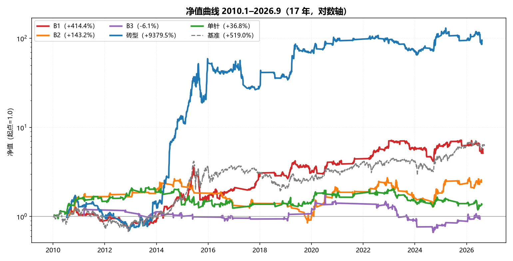
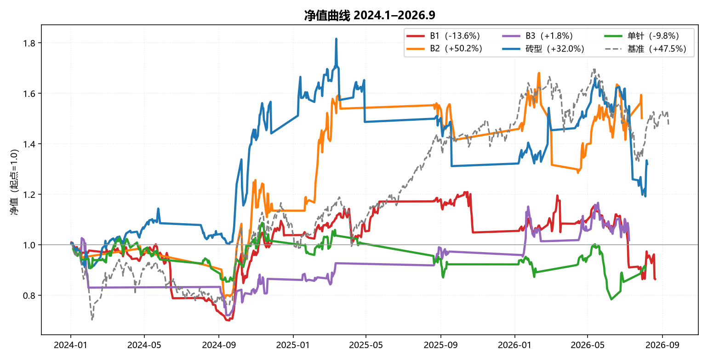

# AS Agent

> **A 股交易决策 Agent** —— 把两套成熟的技术分析体系翻译成可执行代码，跑在通用 Agent 运行时上。
>
> 不是框架，是一套**领域能力包（Skill Bundle）**：7 个技能 · 40+ Python 工具 · 3 条定时任务 · 全市场回测底座。

---

## 这是什么

A 股市场里，绝大多数亏损不是因为"看不懂图"，而是因为**没有体系**：买点随便、仓位随意、离场靠感觉。

AS Agent 要把这件事反过来做 —— **把一套成体系的交易纪律固化成代码**，让每一次决策都有明确依据、可回溯、可复盘。

体系分四层：

```
环境层（什么时候做）
    活跃市值择时 —— 多头才出手（+4% 转多 / −2.3% 转空）
    白线 > 黄线（趋势过滤） · MACD DIF > 0（零轴多头）

流程层（做什么）
    B1 超跌埋伏建仓 → B2 大阳线确认加仓 → B3 主升持有 → 回调后单针补票
    ※ B2 不是独立买点，只作 B1 的加仓位；B3 固定持有 10 个交易日

共振层（依据越多，胜率越高）
    砖型翻红 · MACD 顺周期 · 倍量柱 · 底背离 · 关键K · 缩量止跌

离场层（什么时候走）
    结构止损（跌破买入 K 线最低点即走，不等固定止损位）
    止盈放飞（不设固定目标）· 砖型红翻绿 · 白线破黄线 · 跌破关键K
```

**核心判断：形态只是执行工具，择时才是收益来源。** 这条不是口号 —— 17 年全市场数据已经验证（见下文回测）。

## 它更像一个 Skill，而不是一个框架

本项目**不自研 Agent 框架、不写 ReAct 循环、不引入 LangGraph**。
运行时（工具调用 / 沙箱 / 编排 / 多轮规划）由通用宿主提供，本仓库只负责**领域工程**：

| 层 | 由谁提供 | 本项目做什么 |
|---|---|---|
| 宿主层 | 通用 Agent 运行时 | —（复用，不自研） |
| **领域层** | **本仓库** | 指标代码化、判据与离场规则、专家提示词 |
| 编排层 | **本仓库** | 盘前 / 午间 / 盘后三条定时任务 |

换句话说：**它是装在 Agent 里的一套交易技能，而不是一个交易 Agent 框架。**

---

## 体系介绍

### 五个战法（全部代码化，无主观判断）

| 战法 | 定位 | 判据（代码口径） |
|---|---|---|
| **B1** | 底部超跌埋伏 | 涨幅 ∈ [−2%, +1.8%] · 振幅 < 7% · 量 < 20日均量 · J ≤ 13 · 白线 > 黄线 |
| **B2** | B1 之后的确认加仓 | 前 5 日内有 B1 · 涨幅 > 4% · 量 > 前日 × 1.5 · J < 40 · 上影 < 实体 · 反包 · 不破 B1 低点 |
| **B3** | 主升持有节点 | B2 后 3 日内 · 量 ≤ B2 量 × 0.5 · 实体 ≤ 2% · 不破 B2 低点 · **固定持有 10 个交易日** |
| **砖型** | 共振与持有管理 | 砖型翻红（周期 4/6）· 白线 > 黄线 |
| **单针** | 持股回调补票 | 短期白线 ≤ 20 · 长期红线 ≥ 85 |

指标口径：白线 = `EMA(EMA(C,10),10)`；黄线 = `(MA14+MA28+MA57+MA114)/4`；KDJ(9,3,3)。

### 七个技能

| 技能 | 用途 |
|---|---|
| `market_replay` | 大盘收盘复盘，产出次日可做池 |
| `pre_market_brief` | 盘前提示：今天适不适合交易、仓位多少、观察什么 |
| `stock_analysis` | 单标的复盘：量价、支撑压力、操作建议 |
| `trade_journal` | 交易记录与行为观察 |
| `trade_review` | 盘后复盘闭环：计划验证 → 六项评分 → 明日推演 |
| `trading_assistant` | 专家会诊（多角色交叉质询） |
| `pattern_system` | 图形买点体系的完整规则集 |

### 三条定时任务（仅交易日执行）

| 时间 | 任务 |
|---|---|
| 09:15 | 盘前分析 + 研判落盘 |
| 11:30 | 模拟盘午间买入（代码选股） |
| 21:00 | 盘后复盘 + 认知更新 |

---

## 全市场回测（4,935 只 · 2010.1–2026.9）

> 口径：前复权 · 活跃市值 regime 取 **T-1 日**（无未来函数）· 买入 = 信号日次日开盘 · 往返成本 0.072%
> 收益算法：**每日净值法**（全部信号等权并行、不跳单）· 基准 = 全市场**等权**买入持有

### 长周期（2010.1–2026.9，对数轴）



| 战法 | 交易数 | 交易胜率 | 净值总收益 | 年化 | 最大回撤 | 资金占用率 |
|---|---:|---:|---:|---:|---:|---:|
| B1 | 87,614 | 24.3% | **+414.4%** | **10.3%** | 57.5% | 58.1% |
| B2 | 419 | 31.5% | +143.1% | 5.4% | 68.0% | 22.3% |
| B3 | 173 | **59.5%** | −6.1% | −0.4% | 63.3% | 14.3% |
| **砖型** | 147,429 | 34.7% | **+9,379.5%** | **31.2%** | 63.7% | 53.9% |
| 单针 | 4,573 | 53.6% | +36.8% | 1.9% | 44.6% | 34.1% |
| *基准(等权)* | — | — | *+519.0%* | *11.5%* | — | *100%* |

### 近期（2024.1–2026.9）



| 战法 | 交易数 | 交易胜率 | 净值总收益 | 年化 | 最大回撤 | 资金占用率 |
|---|---:|---:|---:|---:|---:|---:|
| B1 | 31,900 | 24.2% | **−14.9%** | −5.7% | 31.1% | 64.8% |
| **B2** | 233 | 30.9% | **+50.2%** | **16.0%** | 23.6% | 34.1% |
| B3 | 98 | **74.5%** | +1.8% | 0.7% | 29.8% | 26.8% |
| 砖型 | 57,815 | 35.0% | +33.0% | 10.9% | 34.4% | 52.6% |
| 单针 | 2,188 | 55.2% | −9.8% | −3.7% | 27.9% | 38.5% |
| *基准(等权)* | — | — | *+47.5%* | *15.2%* | — | *100%* |

### 长周期与近期为何差异这么大？

同一套规则，砖型年化 **31.2% → 10.9%**，B1 更是 **+414.4% → −14.9%**。原因很简单：

**① 行情结构不同。** 长周期跨越了 2015 杠杆牛与 2019–2021 结构牛，趋势行情多、普涨时间长；而 2024.1–2026.9
真正的主升只有 2024-09 起的"924 行情"一波 —— 图上 2024.1~2024.9 整整 9 个月，五条曲线全部趴在 1.0 附近。

**② B1 反差最大。** B1 是超跌埋伏，需要"之后的普涨"来接。近期段交易胜率 24.2%，与长周期的 24.3% 几乎一样 ——
**信号本身没坏，是赢的那部分变小了**。B1 靠盈亏比赚钱，盈亏比一压缩，正收益就没了。

**③ 砖型在震荡市被反复洗。** 砖型信号密度最高（长周期 14.7 万笔），吃的就是趋势；震荡市里高密度信号变成高频止损。

**④ 基准跑赢了多数战法。** 长周期只有砖型跑赢等权基准，近期段只有 B2 跑赢。
但这恰恰印证了核心判断：**基准是 100% 时间在场，战法只有 14%~65% 时间在场**（见"资金占用率"）。
按单位敞口收益算战法更高 —— 它们只是把时间花在了空仓等待上。**择时是命门。**

---

## 快速开始

```bash
git clone https://github.com/Ahao0911/as-agent.git
cd as-agent
python -m venv .venv
.venv\Scripts\pip install -r requirements.txt     # Windows

# 全市场回测（净值法） + 导出逐日净值与曲线图
.venv\Scripts\python utils\nav_backtest.py
.venv\Scripts\python utils\export_nav_curves.py

# 盘前提示 / 盘后复盘 / 选股 / 交易记录
.venv\Scripts\python utils\pre_market_flow.py --mode deep
.venv\Scripts\python utils\review_flow.py --mode standard
.venv\Scripts\python utils\daily_flow.py --top 5
.venv\Scripts\python utils\trade_journal.py today
```

## 目录结构

```
as-agent/
├── skills/                    # 7 个交易技能（SKILL.md + 入口脚本）
├── utils/                     # 40+ Python 工具
│   ├── experts/               #   2 位专家 + 10 个战法模块 + 规则文档
│   ├── nav_backtest.py        #   每日净值法回测
│   └── export_nav_curves.py   #   净值曲线导出
├── docs/                      # 架构 / 数据源 / 战法模块说明
├── assets/                    # README 图表
├── dashboard_server.py        # 本地工作台（数据桥 + 看板）
├── trading_workbench.html     # 工作台前端
└── requirements.txt
```

## 数据源

优先使用免费源，密钥一律**不入库**（由 `.gitignore` 排除，仓库内只有调用逻辑）：

| 优先级 | 数据源 | 说明 |
|---|---|---|
| 0 | a-stock-data | 行情 / 研报 / 资金面 / 公告 / 打板，多源自动降级 |
| 1 | 非凸 ftshare | A股日线 / 指数 / 可转债 / 南北向 |
| 2 | 妙想 MX · akshare · mootdx · 腾讯行情 | 按需降级 |
| 受控 | 同花顺 iFinD | 仅本地配置，密钥 gitignore |

## 免责声明

本项目为**个人研究项目**，用于学习与技术验证，**不构成任何投资建议**。回测基于当前上市标的、
不含区间内退市个股，存在幸存者偏差（**正收益为上界**）；回测未计滑点与流动性冲击。据此交易，风险自负。

## License

[MIT](LICENSE)
