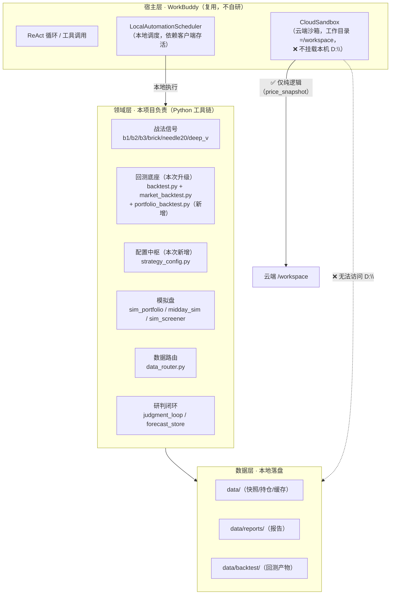
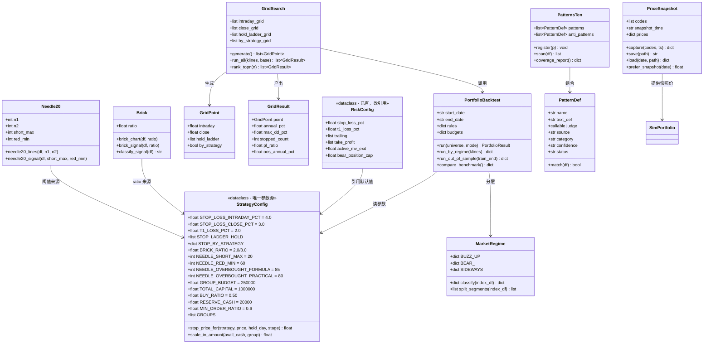
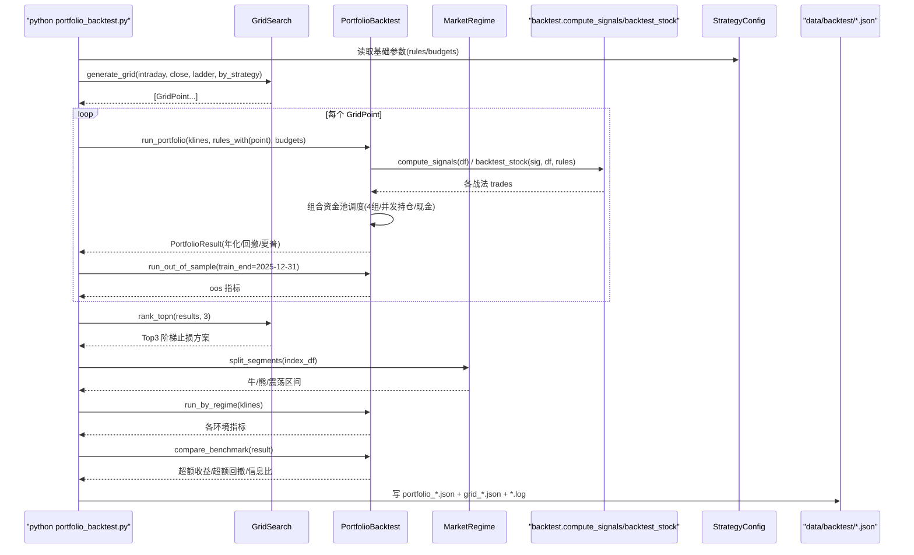
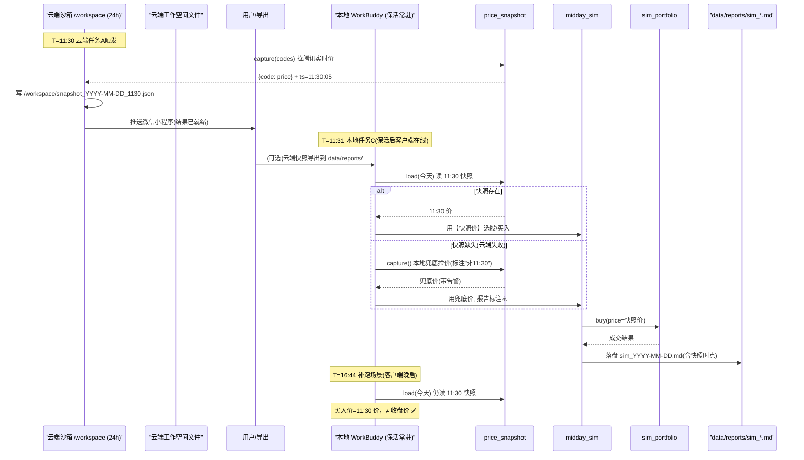
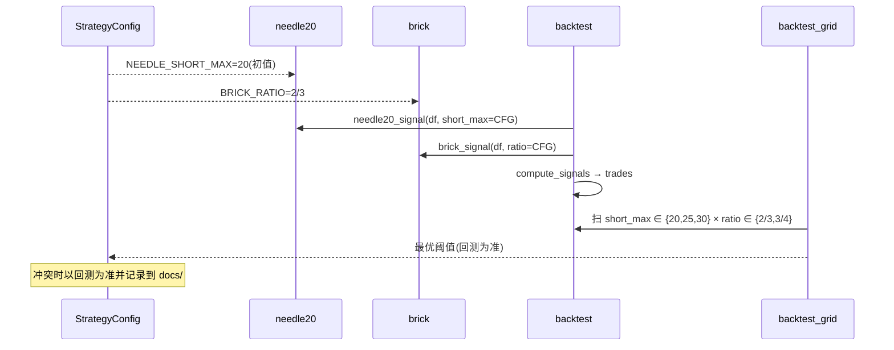
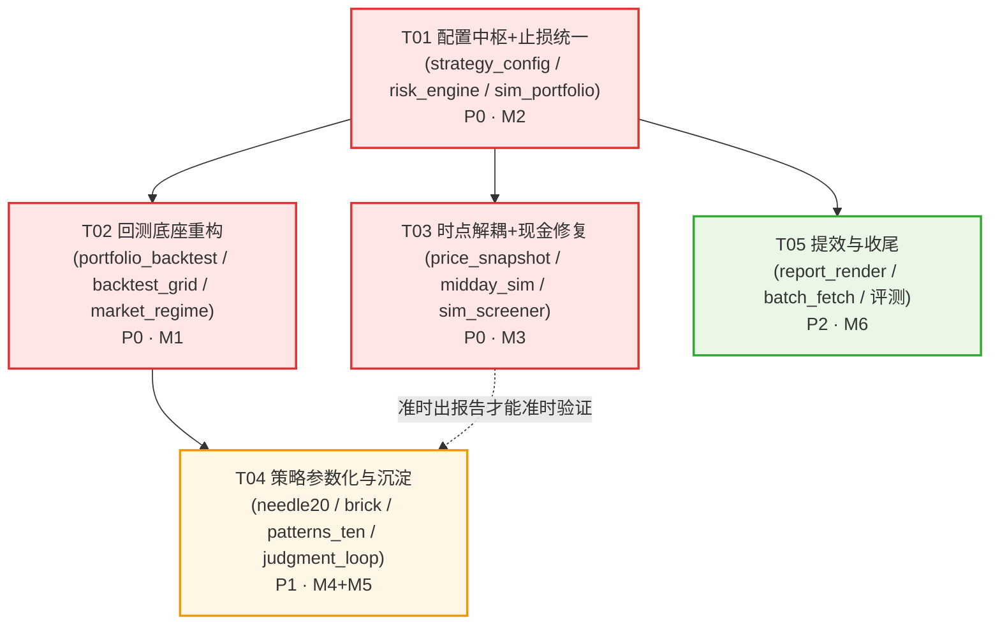

# ARCH · AS Agent 策略全量升级 — 系统架构设计 + 任务分解

| 项目信息 | 内容 |
|---|---|
| **文档名称** | AS Agent 策略升级 · 架构设计说明书（含 R1 可行性验证） |
| **版本** | v1.2（据用户裁决：T01 收窄至 图形买点体系 / P1-3 改 4 大类 / 数据窗口限制） |
| **日期** | 2026-09-10 |
| **架构师** | 高见远 |
| **上游输入** | `docs/PRD_AS-Agent策略升级_2026-09-10.md`（v1.1，PM 许清楚）+ 用户裁决（T01 范围 / Q1·Q2 / P1-3 口径） |
| **项目路径** | `D:\Codes\workspace\ahao-stock-agent` |
| **技术栈** | 复用通用宿主运行时（WorkBuddy）+ 现有 Python 领域工具链；**不引入任何新框架** |
| **口径红线** | 非「自研 Agent 框架 / 自建 ReAct 循环 / 基于 LangGraph」；统一表述为「复用通用宿主运行时，本人负责领域工程」 |
| **安全红线** | 仅模拟盘 + 辅助决策；**严禁**真实账户下单 / 支付 / 外部交易 API |

---

## 0. 结论先行（Executive Summary）

1. **R1 验证结论 = 结论 B：云端沙箱【无法】访问本机 `D:\Codes\workspace\ahao-stock-agent` 下的 Python 脚本与 `data/` 目录。**
   → PRD 的 **P0-5「把 09:15/11:30 两条自动化迁到云端」按原方案【不成立】**，任务迁上去会因找不到脚本/数据而**直接跑不起来**。
   → 必须走**退路方案**（本文 §1.4）：**云端轻量快照（P0-6 的云端子集）+ 本地保活（Windows 计划任务/电源）+ 本地任务保留执行**。

2. **主推方案 = 「本地为主 + 云端只做纯逻辑时点快照」的混合架构**，而非「迁云端」。
   - **11:30 价格快照**（`utils/price_snapshot.py`，仅调腾讯公开行情 API，无本地依赖）→ **可上云端**，解决「午间价被收盘价污染」。
   - **09:15 盘前 / 11:30 全量分析 / 21:00 盘后** → **全部保留本地执行**，用**本地保活**（计划任务定时唤醒 + 开机自启）把「客户端离线导致的 135~449 分钟延迟」压到 ≤10 分钟。
   - 这样既拿到「时点准确」，又不依赖「云端能否读本地文件」这个不成立的假设。

3. **地基优先级不变**：M1（回测框架重构 + 阶梯止损搜索）必须先于 M4（战法/阈值调优）。**回测框架是本次唯一证据来源**。

4. **风险对冲**：若本地保活也不可接受（用户拒绝改电源/计划任务），则降级为 **P0-6 纯本地快照解耦**（11:30 只落快照、分析延后但只用快照价），放弃时点准时性，只保「数据不被污染」。

5. **已与 PM（PRD v1.1）完成的裁决对齐**：
   - **Q1（是否接受本地保活）** ✅ **已裁决=接受**：用户接受「电源不睡眠 + 计划任务 07:45 唤醒 / 07:50 自启 WorkBuddy」→ **走 R-B1**。
   - **Q2（快照如何回本地）** ✅ **已裁决=先人工导出**（微信小程序下载）→ 平台支持 API 后再自动化；T03 指南须写成**可执行步骤**。
   - **Q3（参考线 80 vs A:85/B:30）** ✅ **已裁决=二者用途不同、并存**，在 `strategy_config` **分字段定义**（见 §3）：
     - `NEEDLE_OVERBOUGHT_FORMULA = 85`（《知行深V.txt》公式线，用于四线/穿线买点）
     - `NEEDLE_OVERBOUGHT_PRACTICAL = 80`（本地实战「超涨分界线」，用于「多线站上 80 = 动能透支」预警）
     - 并在 `needle20_rules.md` 标注两者用途差异。**最终以回测为准。**

6. **⭐ 用户裁决（v1.2，两条，直接约束 T01）**：
   - **裁决 A — T01 范围收窄为「只归一 图形买点体系」**：用户原话「这个冲突完全是战法冲突，别搞方向仓位体系战法先，目前规则都是跟着 图形买点体系的」。
     - `strategy_config.py` **只做 图形买点体系**的唯一参数源；全局 -4% 保持为 **图形买点体系线**（B1/B2/B3/单针/砖型共用一套）。
     - **方向仓位体系「五日线战法 -20% 止损」不并入、不改动** —— 它不是 Bug、不是口径冲突，是**另一套独立体系**（方向仓位体系管方向/周期/仓位），本期**不纳入**。
     - **两套体系边界**：本期只归一 图形买点体系口径；**方向仓位体系独立保留**，留待未来单独做方向仓位体系模块。**任何「三处止损不一致」的表述，本质是「图形买点体系内部」的打架，不是与方向仓位体系的冲突。**
     - T01 实际聚焦：① 建配置中枢；② 归一 **图形买点体系内部**口径（`brick_xg` 2/3 vs `brick.py` 3/4）；③ 把 `risk_engine` / `sim_portfolio` / `midday_sim` 三处改为从 `strategy_config` 读取。
   - **裁决 B — 用户核心约束「我喜欢不跑出 WorkBuddy」**：三条分析任务**必须留本地**。
     - ⚠️ **设计前提（显式声明）**：本方案**不是「迁移方案」**，而是「**云端只跑一个纯逻辑快照 + 三条分析任务全部留在本地 WorkBuddy 内 + 本地保活**」。用户已明确认可此形态。
     - 后续任何人不得将本方案解读为「把任务迁出 WorkBuddy / 迁上云端」。云端仅承担 `price_snapshot.py` 这一个无本地依赖的时点快照。

7. **⭐ P1-3「十大完美图」口径变更（v1.2，影响 T04）**：
   - **原口径 ❌**：依赖 ima 读图 → 不可行（图 `can_fetch_content: false`）。
   - **新口径 ✅**：**4 大类文字定义 + 本地重绘案例图**。已完成成果可直接引用：
     - 网络调研报告 `data/kb_manual/十大完美图形_网络调研_2026-09-10.md`：「十大完美图」= 公开渠道「图形买点体系 10 张经典图形」；**4 大类 + 11 个实盘案例 + 4 条判据**：① 完美缩量图形（5例）② N型结构回调买点（3例）③ 一直拉升的回调买点（2例）④ 长期盘整消化洗盘（2例）。
     - 本地重绘图集 `data/kb_manual/charts/`（12 张 PNG）+ `图集索引_十大完美图形.md`；脚本 `utils/kb_charts.py`（用 `utils.data_router.get_daily_bars` 真实行情，含 K线 + 黄白线 + KDJ(J<-10 高亮) + 量能 + 文字面板）。
     - 开源对标 `某开源同类技能仓库`（MIT，口径=沙漏评分 + B1 + 量价共振）：**只借思路，不引入外部依赖**。
   - `patterns_ten.py` 按 **4 大类**实现，**删除读图依赖**。

---

## Part A：系统设计

### 1. 实现方案（Implementation Approach）

#### 1.1 核心难点与应对

| 编号 | 难点 | 本质 | 应对策略 |
|---|---|---|---|
| **D1** | **云端能否访问本地脚本/数据（R1）** | 平台能力边界问题 | **已查实=不能**（见 §1.3）；改用「云端快照 + 本地保活」混合架构 |
| **D2** | 回测框架从「单战法」→「组合 + 分层 + 网格 + 样本外」 | 现有 `market_backtest.py` 是「一战法一账户」，无组合资金池、无环境维度、无参数扫描 | **不重写**，在现有 `compute_signals()`/`backtest_stock()` 之上**加一层组合调度器**（`portfolio_backtest.py`），复用已成熟的信号与离场逻辑 |
| **D3** | 图形买点体系内部止损口径打架（`brick_xg` 2/3 vs `brick.py` 3/4；`risk_engine` vs `sim_portfolio`） | 无单一配置来源 | 新建 `utils/strategy_config.py` 作为 **图形买点体系唯一参数源**；**方向仓位体系（-20%）独立保留，不在本期范围**（v1.2 裁决 A） |
| **D4** | 单针下30 阈值无代码出处 | 需求只有直播口述 | **阈值参数化**（`needle20.py` 增加 `n1/n2/threshold` 入参），让回测能反推最优，再回写配置 |
| **D5** | 砖型 3/4 vs 2/3 不一致（**图形买点体系内部**） | 两处硬编码 | 统一到 `strategy_config.BRICK_RATIO=2/3`，并**分级**：绿转红=基线、绿转强红(≥2/3)=增强 |
| **D6** | 十大完美图从「片段证据」→「可代码化判据」 | 知识源是非结构化口述/图 | **v1.2：改 4 大类文字定义 + 本地重绘**（删 ima 读图依赖）；`PatternDef` 增 `category` 字段 |
| **D7** | 11:30 时点快照与执行解耦 | 时间与执行耦合 | 快照脚本**纯函数化**（输入 code 列表→输出 JSON），本地/云端均可跑，落盘到各自工作空间 |
| **D8** | **腾讯源日 K 窗口限制（≈261 条 / ≈1 年）** | 十大图案例时点（2025-05~11）部分早于窗口 | 重绘图已用**红色警示框**标注「案例时点早于数据窗口」；如需精确当期图 → 改用本地 `kline_cache.db` / mootdx / iFinD（见 R9） |

#### 1.2 技术选型（不引入新框架）

| 层 | 选型 | 理由 |
|---|---|---|
| 宿主运行时 | **WorkBuddy（复用，不改造）** | 口径红线；提供 ReAct 循环/工具调用/沙箱权限 |
| 语言/运行时 | **Python 3 + `.venv\Scripts\python.exe`** | 现有 49 工具全为 Python，零迁移成本 |
| 数据处理 | **pandas + numpy** | 现有回测/指标已依赖 |
| 数据源 | **腾讯 `qt.gtimg.cn` / `data_router`（多源路由）** | 快照只需公开只读行情，无本地依赖 |
| 配置 | **`utils/strategy_config.py`（dataclass）** | 单一参数源，替代散落的魔法数字 |
| 调度 | **WorkBuddy `LocalAutomationScheduler`（现成）+ Windows 任务计划程序（保活）** | 不改造宿主调度器；保活用 OS 原生能力 |
| 可视化/报告 | **Markdown + JSON 双写（沿用现有约定）** | 与现有 `data/reports/*.md` + `data/backtest/*.json` 一致 |

> **不引入**：LangGraph / autogen / FastAPI / 任何 Web 框架 / 新回测库（backtrader、vectorbt 等）。理由：现有 `backtest.py` 已满足信号与离场口径，重写会丢失「战法自己的离场规则」这一核心资产。

#### 1.3 架构分层图



#### 1.4 ⭐ R1 验证结论与退路方案（最关键）

##### 1.4.1 结论：**结论 B —— 云端沙箱无法访问本机本地脚本与 `data/`**

**证据链（三条独立来源交叉验证）**：

| 证据 | 来源 | 原文/事实 |
|---|---|---|
| ① 官方文档只描述「本地工作空间」 | WorkBuddy 官方 `docs/workbuddy/Quickstart` | 「**本地文件操作**：可读取授权的电脑文件夹」—— 明确是 **PC 客户端能力**；文档全程**没有**「云端工作/云端沙箱」章节 |
| ② 官方「选择工作空间」= 本地目录 | 官方 `docs/workbuddy/Create-Task` | 「点击输入框左下角的**选择工作空间**，选择当前任务要使用的目录」；「重命名…**仅修改显示名，不改变实际文件夹路径**」→ 工作空间 = **本机绝对路径** |
| ③ 第三方文章明确「云端不能访问本地文件」 | 《Workbuddy入门到精通·41》 | 「**云上模式（云端沙箱）**：不能访问你电脑里的本地文件，只能处理你上传到云端的文件或微信里收到的文件」；「**要动你电脑里的文件 → 必须电脑开机，走本机模式**」 |
| ④ 对比表佐证 | 《WorkBuddy 双模运行机制》 | 本地执行模式「**可以访问用户电脑上的所有文件…这是云端沙箱模式做不到的**」；云端沙箱「任务完自动删除，沙箱隔离」 |
| ⑤ 云端工作目录是 `/workspace` | 实际小程序截图（搜索证据 5） | 云端任务产物路径显示为 `完整报告已保存至：/workspace/…` → 云端是 **Linux 沙箱**，**不存在 `D:\` 盘** |
| ⑥ **本机配置实证** | `C:\Users\Ahao\.workbuddy\automation-backups\*.json`（只读） | 三条任务全部：`cwds: ["D:\\Codes\\workspace\\ahao-stock-agent"]`、由 `LocalAutomationScheduler` 调度、`permissionMode: fullAccess`、prompt 内写死 `.venv\Scripts\python.exe`。**没有任何 cloud/workspace-sync 字段** |
| ⑦ 迁移文章只迁移「纯提示词任务」 | 腾讯云开发者《定时任务没发邮件？》 | 云端迁移示例任务是「抓新闻→发邮件」（**纯网络逻辑，无本地脚本**），未涉及本地 `.py` 或 `data/` |

**技术常识佐证**：浏览器/小程序端的「云端工作」是**腾讯云隔离沙箱**（云端 Linux 容器），与本机 Windows 文件系统物理隔离。要让云沙箱读到 `D:\`，必须有「工作空间同步/挂载」机制，而**官方文档与所有第三方资料均无此说明**，本机配置中也无同步痕迹（仅有 `edge-sync-mapping-*.db`，那是指令/会话的边端同步，非工作目录挂载）。

> **结论**：**P0-5 按「原方案（把本地脚本任务整体迁云端）执行 = 必然失败」**。若强行执行，云端会因找不到 `utils/*.py` 与 `data/` 而无法运行任何 Python 脚本 → 09:15/11:30 两条任务全部作废。

##### 1.4.2 退路方案设计（主推）

**方案名称：「时点快照上云 + 分析执行留本地 + 本地保活」混合架构**

核心洞察：**11:30 真正「必须卡时点」的只有一件事——把价格落盘**（解决「收盘价冒充午间价」）。而**分析**可以晚，只要**只用 11:30 的快照价**。因此把「对时点敏感的纯逻辑」与「依赖本地数据的重逻辑」拆开：

```
┌───────────────────────── 云端沙箱（腾讯云，24h 在线，电脑关机也跑）──────────────────────────┐
│  任务 A【11:30 价格快照】（唯一上云任务）                                                     │
│   • 纯逻辑：从公开行情 API 拉指定股票实时价 → 写云端 /workspace/snapshot_YYYY-MM-DD_1130.json │
│   • 无本地依赖（不含 utils/ 业务脚本，快照逻辑独立自包含）                                     │
│   • 结果推微信小程序；文件留存云端工作空间，供本地"取回"                                      │
└───────────────────────────────────────────────────────────────────────────────────────────┘
                                          │  云端工作空间
                                          ▼  （人工或脚本导出，见 T-M3-2）
┌───────────────────────── 本地电脑（Windows，靠保活常驻）─────────────────────────────────────┐
│  保活：任务计划程序 07:45 唤醒/开机 → 07:50 自启 WorkBuddy.exe（最高权限）→ 客户端常驻          │
│  任务 B【09:15 盘前】  本地执行（现成 prompt 不变，仅修口径）                                  │
│  任务 C【11:30 午间分析】本地执行：先读「11:30 快照」→ 只用快照价选股/买入（禁止用当前价）        │
│  任务 D【21:00 盘后】  本地执行（依赖 data/，不变）                                           │
└───────────────────────────────────────────────────────────────────────────────────────────┘
```

**为什么这样拆是对的？**
- 云端只承担**最轻、最不依赖本地**的一件事（快照），云端能力边界内可 100% 完成。
- 本地保活解决 PRD 里真正的延迟根因（**客户端离线**，非模型/脚本耗时——PRD §3.5 已证）。
- 「快照价 vs 收盘价」的污染问题**在数据源头就解决**，与「分析何时跑」解耦。

**退路方案的两个子选项（按用户接受度排序）**：

| 子选项 | 做法 | 时点准时性 | 数据准确性 | 用户需做的系统改动 | 状态 |
|---|---|---|---|---|---|
| **R-B1（✅ 已选定）** | 云端快照 + 本地保活 | ✅ 云端任务准时；本地任务靠保活≤10min | ✅ 快照价 | 需设 Windows 保活（用户**已确认接受**，见 Q1） | **本期采用** |
| **R-B2（降级预案）** | **纯本地**快照解耦（P0-6 单做） | ⚠️ 11:30 若客户端离线仍会晚 | ✅ 快照价 | 可不改系统 | 备用 |

> **用户裁决（v1.2）**：**Q1 = 接受本地保活 → 走 R-B1**；并强调「**我喜欢不跑出 WorkBuddy**」→ 三条分析任务**必须留本地**。故本方案**不是迁移方案**，云端仅跑 `price_snapshot.py` 一个纯逻辑快照。

**本地保活的具体做法（只写步骤，不代改系统配置）**：
1. `控制面板 → 电源选项`：设置「接通电源时：从不睡眠/休眠」，笔记本合盖设为「不采取任何操作」。
2. `任务计划程序（taskschd.msc）→ 创建基本任务`：
   - 触发器：每个工作日 07:45（**该时间早于 09:15，且给开机/登录留缓冲**）。
   - 操作：启动程序 `WorkBuddy.exe`（路径以实际安装为准），勾选「使用最高权限运行」。
   - 条件：勾选「唤醒计算机运行此任务」+「不管用户是否登录都要运行」。
3. BIOS/网卡：如需「关机后自动开机」，开启 RTC 定时开机 或 Wake-on-LAN（需硬件支持）。
4. 校验：连续 5 个交易日检查 `C:\Users\Ahao\.workbuddy\logs\automation.log` 无「skip missed / 延迟 > 10min」。

##### 1.4.3 对 PRD P0-5 的修订建议（回传 PM/主理人）

| PRD 原文（P0-5） | 架构修订后 |
|---|---|
| 「09:15 盘前 + 11:30 午间迁云端，21:00 保留本地」 | **「11:30 时点快照上云；09:15/11:30/21:00 三条分析任务保留本地 + 本地保活」** |
| 验收：电脑关机也能按点跑 | **修订**：云端快照任务「关机也按点跑」✅；本地分析任务「靠保活，≤10min」✅（需用户配合系统设置） |
| 依赖：P0-6 先验证云端可访问性 | **已结论：不可访问**；P0-5 由「迁移」降级为「快照上云 + 保活」 |

> ⚠️ **若用户坚持「必须整体上云」**：唯一可行路径是把整套 Python 工具链「打包/上传到云端工作空间」，但云端沙箱是非持久、任务完即删（证据④），**不可行**。故本条无第二解。

---

### 2. 文件清单（新增 / 修改）

> 约定：**新增**=本次创建；**修改**=在现有文件上改动。JSON/日志为产物，不入代码清单。

| # | 文件（相对路径） | 动作 | 归属需求 | 说明 |
|---|---|---|---|---|
| 1 | `utils/strategy_config.py` | **新增** | P0-3 / P0-8 / P1-1 / P1-2 | **图形买点体系唯一参数源**（止损/止盈/预算/砖型比例/单针阈值/分组）；**方向仓位体系不并入** |
| 2 | `utils/portfolio_backtest.py` | **新增** | P0-1 | 组合回测 + 环境分层 + 参数网格 + 样本外 + 基准对比 调度器 |
| 3 | `utils/backtest_grid.py` | **新增** | P0-1 / P0-2 | 参数网格生成 + 批量跑 + Top-N 排名（可被 portfolio_backtest 调用） |
| 4 | `utils/market_regime.py` | **新增** | P0-1 / P0-4 | 牛/熊/震荡三类环境切分（复用 `market_env.py` 判据，不另造） |
| 5 | `utils/price_snapshot.py` | **新增** | P0-6 | 11:30 价格快照（纯逻辑，可上云） |
| 6 | `utils/needle20.py` | **修改** | P1-1 | 阈值参数化（`n1/n2/short_th/red_th`），支持下20/下30 切换 |
| 7 | `utils/brick.py` | **修改** | P1-2 | 3/4 → 2/3；新增「基线信号 / 增强信号」分级字段 |
| 8 | `utils/screen_brick_xg.py` | **修改** | P1-2 | 比例引用改为读 `strategy_config.BRICK_RATIO` |
| 9 | `utils/risk_engine.py` | **修改** | P0-3 | `RiskConfig` 默认值改为引用 `strategy_config`；显式定义 `t1_loss_pct` 与主止损优先级 |
| 10 | `utils/sim_portfolio.py` | **修改** | P0-3 / P0-7 | `buy()` 默认止损改读 config；现金死区修复（动态单笔/门槛下调） |
| 11 | `utils/midday_sim.py` | **修改** | P0-3 / P0-6 / P0-7 | 止损口径改读 config（T01）；结算与买入优先读快照价（T03）；现金自适应 |
| 12 | `utils/sim_screener.py` | **修改** | P0-6 | 精筛结算价优先取快照 |
| 13 | `utils/market_backtest.py` | **修改** | P0-1 / P0-2 | 支持 `stop_loss_grid` / 组合模式入口 / 日志留痕 |
| 14 | `utils/patterns_ten.py` | **新增** | P1-3 | 十大完美图判据（**4 大类**，`PatternDef{name,text_def,judge,source,category,confidence,status}`），**删读图依赖** |
| 15 | `utils/judgment_loop.py` | **修改** | P1-4 | 情景树结构化字段 + 权重校准 |
| 16 | `utils/report_render.py` | **新增** | P2-1 | 报告脚本模板化（md+json 双写） |
| 17 | `utils/batch_fetch.py` | **新增** | P2-2 | 合并碎片缓存批处理 |
| 18 | `docs/止损口径对照表.md` | **新增** | P0-3 | 「修改前 vs 修改后」口径对照 + **两套体系边界**说明 |
| 19 | `docs/prompt_代码口径对照表.md` | **新增** | P0-8 | prompt ↔ 代码逐项对照 |
| 20 | `docs/云端迁移与本地保活操作指南.md` | **新增** | P0-5 | R1 结论 + **R-B1 保活步骤**（交用户执行）+ 快照回传步骤 |
| 21 | `data/backtest/` | 产物目录 | P0-1 | `portfolio_*.json` / `grid_*.json` / `*.log` |
| 22 | `data/reports/sim_YYYY-MM-DD_price_1130.json` | 产物 | P0-6 | 快照落盘格式 |
| 23 | `utils/kb_charts.py`（已存在） | 复用 | P1-3 | 本地重绘图脚本（真实行情，供 patterns_ten 校验案例） |
| 24 | `data/kb_manual/`（已存在） | 引用 | P1-3 | 网络调研报告 + 12 张重绘图 + 图集索引 |

---

### 3. 数据结构与接口（Mermaid classDiagram）



**关键接口签名（给工程师直接实现）**：

```python
# utils/strategy_config.py
# ⚠️ 范围声明（v1.2 裁决 A）：本配置 = 【图形买点体系】唯一参数源。
#    方向仓位体系（五日线战法 -20% 止损等）【不并入】本文件，独立保留，留待未来单独做方向仓位体系模块。
@dataclass(frozen=True)
class StrategyConfig:
    STOP_LOSS_INTRADAY_PCT: float = 4.0     # 盘中止损（图形买点体系线，B1/B2/B3/单针/砖型共用一套）
    STOP_LOSS_CLOSE_PCT: float = 3.0        # 盘后止损
    T1_LOSS_PCT: float = 2.0                # T+1 灵活离场（优先级：盘中止损 > T+1 > 移动止盈）
    STOP_LADDER_HOLD: list = [(3, 5.0), (10, 4.0), (9999, 3.0)]  # (持有天数上限, 该段阈值)
    STOP_BY_STRATEGY: dict = {"B1": 5.0, "B2": 4.0, "B3": 4.0, "砖型": 4.0, "单针": 3.0}
    BRICK_RATIO: float = 2.0 / 3.0
    NEEDLE_SHORT_MAX: int = 20              # P1-1 反推后可改 30
    NEEDLE_RED_MIN: int = 60
    NEEDLE_OVERBOUGHT_FORMULA: int = 85     # Q3 裁决: 公式线(《知行深V.txt》), 四线/穿线买点
    NEEDLE_OVERBOUGHT_PRACTICAL: int = 80   # Q3 裁决: 实战超涨分界线("多线站上80=动能透支"预警)
    GROUP_BUDGET: float = 250000.0
    TOTAL_CAPITAL: float = 1000000.0
    BUY_RATIO: float = 0.50
    RESERVE_CASH: float = 20000.0
    MIN_ORDER_RATIO: float = 0.6            # P0-7 现金 ≥ 门槛×60% 即可成交
    GROUPS: list = ["B1组", "砖型组", "单针组", "深V组"]

    def stop_price_for(self, strategy, price, hold_day=1, stage="intraday") -> float: ...
    def scale_in_amount(self, avail_cash, group_budget) -> float: ...   # P0-7 动态单笔

# ─────────────────────────────────────────────────────────────
# 【两套体系边界】—— 本期不碰方向仓位体系
#   图形买点体系（本期归一）：B1 / B2 / B3 / 砖型 / 单针  → 由 StrategyConfig 统一管理
#   方向仓位体系（独立保留）: 五日线战法 -20% 止损 等     → 不并入、不改动
#   判定原则：现有全局 -4% 是 图形买点体系线；与方向仓位体系 -20% 不是"冲突"，是两套独立体系。
# ─────────────────────────────────────────────────────────────

# utils/price_snapshot.py  （★纯逻辑，云端/本地共用同一份；PRD v1.1 验收第 6 条）
# 约束: 不 import 任何 utils/ 业务模块、不读写 data/ 以外路径 → 可在云端 /workspace 独立运行
# 仅依赖: requests + 腾讯公开行情 API（qt.gtimg.cn），不依赖 pandas/项目其他文件
def capture(codes: list[str], ts: str | None = None) -> dict:
    """拉腾讯实时价 → {code: {price, name, ts}}；无本地文件依赖"""
def save(snap: dict, date: str | None = None, out_dir: str = "data/reports") -> str:
    """写 data/reports/sim_YYYY-MM-DD_price_1130.json，返回路径"""
def load(date: str, out_dir: str = "data/reports") -> dict:
    """读回快照；缺失返回 {}"""
def prefer_snapshot(date: str, code: str, fallback_price: float) -> float:
    """结算时优先取快照价，无快照才回落 fallback"""

# utils/portfolio_backtest.py
def run_portfolio(klines: dict, rules: dict, budgets: dict, start: str, end: str) -> dict:
    """组合回测：4 组资金池 + 并发持仓 + 现金管理 → 组合年化/回撤/夏普"""
def run_by_regime(klines: dict) -> dict:
    """按 market_regime 分牛/熊/震荡，各环境独立输出指标"""
def run_out_of_sample(klines: dict, train_end: str = "2025-12-31") -> dict:
    """训练(2024~2025)/验证(2026) 切分"""
def compare_benchmark(result: dict) -> dict:
    """vs 沪深300：超额收益/超额回撤/信息比"""

# utils/backtest_grid.py
def generate_grid(intraday=(3,4,5,6), close=(2,3,4),
                  hold_ladders=(None,), by_strategy=(False, True)) -> list[GridPoint]: ...
def run_all(klines: dict, base_rules: dict, grid: list) -> list[GridResult]: ...
def rank_topn(results: list[GridResult], n: int = 3) -> list[GridResult]: ...

# utils/needle20.py（修改）
def needle20_lines(df, n1: int = 3, n2: int = 21): ...          # 现有签名保留，新增参数化
def needle20_signal(df, short_max: int = 20, red_min: int = 60): ...  # 下20 / 下30 切换

# utils/patterns_ten.py（新增）
@dataclass
class PatternDef:
    name: str
    text_def: str
    judge: Callable[[pd.DataFrame], bool]
    source: str          # 来源片段（文件名+行）
    confidence: str      # 高/中/低
    status: str          # 已代码化/仅定义/待归纳
```

**落盘格式约定（快照 JSON）**：

```json
{
  "date": "2026-09-11",
  "snapshot_time": "2026-09-11T11:30:05+08:00",
  "source": "tencent_qt",
  "count": 42,
  "prices": {
    "600519": {"name": "贵州茅台", "price": 1688.0, "ts": "2026-09-11T11:30:04+08:00"}
  },
  "elapsed_ms": 1850
}
```

---

### 4. 程序调用流程（Mermaid sequenceDiagram）

#### 4.1 回测框架：组合 + 分层 + 网格（P0-1 / P0-2）



#### 4.2 快照解耦后的 11:30 时间线（P0-6 / P0-5 退路）



#### 4.3 单战法信号 → 参数化 → 回测反推（P1-1 / P1-2）



---

### 5. Anything UNCLEAR / 假设与待明确

见 §Part B 第 9 节「待明确事项」。此处记录架构层假设：

- **A1**：~~假设用户接受本地保活~~ → **PM 已确认：默认按 R-B1 交付，R-B2 为降级预案；最终接受度待主理人向用户确认**（本文只给步骤，由用户决定）。
- **A2**：~~假设云端快照可导出到本地~~ → **PM 已裁决：先人工导出（微信小程序下载），平台支持 API 后再自动化**。
- **A3**：假设「工作空间」在同账号多端之间**不自动同步文件**（依据官方文档「仅改显示名不改路径」）。若实际有同步能力 → R1 结论需复核。
- **A4**：模拟盘样本仅 29 天/9 笔（PRD R7），架构上以**回测为主证据**，模拟盘为辅。

---

## Part B：任务分解

### 6. 依赖包列表（Required Packages）

**本次升级不新增任何第三方包。** 全部能力由现有依赖满足：

```
# 现有依赖（requirements.txt，保持不变）
pandas          # 数据处理 / 回测
numpy           # 数值计算
requests        # 腾讯行情 API
akshare         # 指数/成分股/兜底数据源
mootdx          # 多源交叉核对（已有）
# 其余：标准库(dataclasses/json/argparse/datetime/concurrent.futures) 即可
```

> 如需（可选、非必需）：无。**严禁**为回测引入 backtrader/vectorbt 等新框架（与口径红线及「复用现有资产」原则冲突）。

---

### 7. 任务列表（按依赖排序，M1→M6）

> **规则遵守**：≤5 个任务；每任务 ≥3 个文件；首任务=项目基础设施；按功能模块分组。
> 由于本项目为**存量工程升级**（非从零建项目），「项目基础设施」= **配置中枢 + 口径统一底座**（T01），它是所有后续任务的公共依赖。

| 任务ID | 任务名称 | 源文件（改/增） | 依赖 | 优先级 | 里程碑 |
|---|---|---|---|---|---|
| **T01** | **配置中枢 + 止损口径统一（地基·所有任务的公共依赖）** | 新增 `utils/strategy_config.py`；修改 `utils/risk_engine.py`、`utils/sim_portfolio.py`；新增 `docs/止损口径对照表.md`、`docs/prompt_代码口径对照表.md` | 无 | P0 | M2 |
| **T02** | **回测底座重构（组合 + 环境分层 + 参数网格 + 样本外 + 基准）** | 新增 `utils/portfolio_backtest.py`、`utils/backtest_grid.py`、`utils/market_regime.py`；修改 `utils/market_backtest.py` | T01 | P0 | M1 |
| **T03** | **时点解耦与现金修复（快照 + 现金死区 + 云端/保活交付物）** | 新增 `utils/price_snapshot.py`、`docs/云端迁移与本地保活操作指南.md`；修改 `utils/midday_sim.py`、`utils/sim_screener.py` | T01 | P0 | M3 |
| **T04** | **策略参数化与沉淀（单针下30 + 砖型2/3 + 十大图 + 研判闭环）** | 修改 `utils/needle20.py`、`utils/brick.py`、`utils/screen_brick_xg.py`、`utils/judgment_loop.py`；新增 `utils/patterns_ten.py` | T02（参数需回测反推） | P1 | M4+M5 |
| **T05** | **提效与收尾（报告模板化 + 批处理 + 评测/技能排查）** | 新增 `utils/report_render.py`、`utils/batch_fetch.py`；产出 `docs/ponytail评测结论.md`、`docs/技能触发词冲突矩阵.md` | T01 | P2 | M6 |

#### T01 · 配置中枢 + 止损口径统一（P0-3 / P0-8 前置）【v1.2 范围收窄】

> **⚠️ 范围（裁决 A）**：本任务**只归一 图形买点体系**，**方向仓位体系五日线战法 -20% 不并入、不改动**。聚焦三件事：① 建配置中枢；② 归一 **图形买点体系内部**打架（`brick_xg` 2/3 vs `brick.py` 3/4）；③ `risk_engine`/`sim_portfolio`/`midday_sim` 三处改为从 `strategy_config` 读。

**目标**：建立 **图形买点体系** 唯一参数源，消除 图形买点体系内部的口径打架，供后续所有任务引用。

**具体改动（改哪个文件的哪个函数）**：
1. **新增** `utils/strategy_config.py`：定义 §3 的 `StrategyConfig` dataclass（**范围声明：只含 图形买点体系**），含 `stop_price_for()` 与 `scale_in_amount()` 两个方法。**所有 图形买点体系阈值/预算/比例在此定义一次。** 方向仓位体系**不写入**。
2. **修改** `utils/risk_engine.py`：
   - `RiskConfig.stop_loss_pct` 默认值改为引用 `StrategyConfig().STOP_LOSS_INTRADAY_PCT`；
   - 在 `check_position()` 顶部注释显式写明**优先级：盘中止损 > `t1_loss_pct`(T+1) > 移动追踪止盈 > 阶梯止盈**（修 P0-3 验收项 2）；
   - **不动**任何方向仓位体系相关逻辑（如有则加注释标明「方向仓位体系，独立保留，不在本期范围」）。
3. **修改** `utils/sim_portfolio.py`：
   - `buy()` 内 `stop = round(price * 0.96, 3)` → `stop = StrategyConfig().stop_price_for(strategy=group_to_strategy(group), price=price)`；
   - 加仓分支 `old["止损价"] = round(new_cost * 0.96, 3)` 同样改为调 `stop_price_for()`。
4. **修改** `utils/midday_sim.py`：买入/结算处的止损口径统一改为读 `strategy_config`（与 `sim_portfolio` 同源）。
5. **新增** `docs/止损口径对照表.md`：列「位置 / 修改前 / 修改后 / 依据」，并**增一节「两套体系边界」**说明 图形买点体系 vs 方向仓位体系各自独立。
6. **新增** `docs/prompt_代码口径对照表.md`：三条 automation prompt 的止损/预算/组数/单笔比例 ↔ 代码实际值，逐项对齐（prompt 文本由主理人在 WorkBuddy 侧更新，本任务只产出对照表 + 建议文本）。

**验收**：`grep -rn "0.96\|0.97" utils/` 仅剩 `strategy_config.py` 内定义（**图形买点体系线**）；跑 `python utils/sim_portfolio.py risk-check` 行为符合预期；`docs/止损口径对照表.md` 含体系边界说明。

#### T02 · 回测底座重构（P0-1 / P0-2）

**目标**：在现有信号/离场逻辑之上加组合调度层，新增环境分层与参数网格。

**具体改动**：
1. **新增** `utils/market_regime.py`：`classify(index_df)` 复用 `utils/market_env.py` 的 MA5/10/20 判据，映射为「牛市/熊市/震荡」；`split_segments()` 返回区间列表（阈值可配：60日涨幅 >+10% 牛 / <-10% 熊 / 其余震荡，**与 PRD §5.4 一致**）。
2. **新增** `utils/portfolio_backtest.py`：
   - `run_portfolio(klines, rules, budgets, start, end)`：4 组（B1组/砖型组/单针组/深V组）独立资金池 + 并发持仓 + 现金管理 → 组合年化/回撤/夏普；
   - `run_out_of_sample(klines, train_end="2025-12-31")`；`compare_benchmark(result)`（复用 `market_backtest.get_benchmark()`）；
   - `run_by_regime(klines)`。
3. **新增** `utils/backtest_grid.py`：
   - `generate_grid(intraday=(3,4,5,6), close=(2,3,4), hold_ladders=(None,), by_strategy=(False,True))`；
   - `run_all()` / `rank_topn(n=3)`；每个 `GridResult` 记录**被扫止损次数**（P0-2 验收项 2）。
4. **修改** `utils/market_backtest.py`：
   - `main()` 新增 `--grid` / `--portfolio` / `--oos` 子模式；
   - `run_backtest_market()` 增加 `stop_loss_grid` 透传（注入 `rules` 的 `stop_pct`）；
   - `main()` 末尾写 `data/backtest/*.log`（P0-1 验收项 5 可重复性留痕）。
5. **产物**：`data/backtest/portfolio_*.json`、`grid_*.json`、`*.log`。

**验收**：4 组组合回测出年化/回撤/夏普；阶梯止损 Top3（含相对统一 -4% 的改善幅度）；样本外复核；基准对照。

> **对标基准（PRD §5.1b，来自开源 `lululu811/pattern`，可作 T02 五项硬指标参照）**：Sharpe≥0.5 / Calmar≥0.5 / WinRate≥40% / MaxDD≤25% / **OOS-IS≥0.6**（样本外与样本内一致性）。其最优参数（**J=5 / SL=-5% / Vol=0.8**；分市况 SIDEWALK J=12 SL=-3% / BULL J=12 SL=-5% / BEAR J=3 SL=-2%）可作 **P0-2 网格搜索起点参考**。⚠ **警示**：该项目同样出现「收益升但回撤 17.4%→60.2% 激增」的过度优化 → **强化样本外复核（R6）不可省**。

#### T03 · 时点解耦与现金修复（P0-6 / P0-7 / P0-5 退路交付）【v1.2 口径澄清】

> **范围澄清（PRD v1.2 / 裁决 B）**：`price_snapshot.py` **本期只做本地运行即可**。「纯逻辑」的设计目的是**可测试 + 将来可选上云**，**本期不强制上云**；三条分析任务**必须留在本地 WorkBuddy**（用户约束）。指南重点写**本地保活步骤**，快照导出写「先人工导出」。

**具体改动**：
1. **新增** `utils/price_snapshot.py`：实现 §3 的 `capture/save/load/prefer_snapshot`。**保持纯逻辑（PRD 验收第 6 条）：不 import 任何 `utils/` 业务模块、不读写 `data/` 以外路径** —— 目的是**可独立测试 + 将来可选上云**（本期默认本地运行）。仅用 `requests` + 腾讯公开 API（`qt.gtimg.cn`），单次执行 <1 分钟；写 `data/reports/sim_YYYY-MM-DD_price_1130.json`。
2. **修改** `utils/sim_screener.py`：精筛结算价处，优先调 `price_snapshot.prefer_snapshot(date, code, cur_price)`。
3. **修改** `utils/midday_sim.py`：
   - 买入/结算读快照价；无快照则本地兜底并**在报告标注⚠️**；
   - 现金自适应：买入时用 `StrategyConfig.scale_in_amount(avail_cash, group_budget)`（P0-7：现金 ≥ 门槛×60% 即成交，不再空转）。
4. **新增** `docs/云端迁移与本地保活操作指南.md`：**重点=本地保活可执行步骤**（电源不睡眠 + taskschd.msc 07:45 唤醒 / 07:50 自启 WorkBuddy，交用户执行）；含 **R1 结论**（为何不整体迁云端）、**快照回传步骤（Q2：先人工导出/微信小程序下载）**、验证方法。**本期快照脚本默认本地运行，不强制上云**。

**验收**：模拟「16:44 补跑」→ 买入价 = `_price_1130.json` 价 ≠ 收盘价；快照时间戳误差 ≤1min；现金 ≥7.2 万有信号即可成交；**纯逻辑校验：`price_snapshot.py` 不 import `utils/`、不读写 `data/` 外路径（为可测试 + 将来可选上云，本期本地运行）**。

#### T04 · 策略参数化与沉淀（P1-1 / P1-2 / P1-3 / P1-4）

**具体改动**：
1. **修改** `utils/needle20.py`：`needle20_lines(df, n1=3, n2=21)` 增加参数；`needle20_signal(df, short_max=20, red_min=60)`；阈值默认读 `StrategyConfig`，**便于 T02 网格扫 20/25/30 反推**。
2. **修改** `utils/brick.py`：`_green_peak_before()` 及 3/4 硬编码（L20/L132/L139）改为读 `StrategyConfig.BRICK_RATIO`；新增 `classify_signal(df) -> "基线"|"增强"`（绿转红=基线，绿转强红≥2/3=增强）。
3. **修改** `utils/screen_brick_xg.py`：L81 `green_h * 2/3` → 读 `StrategyConfig.BRICK_RATIO`（消除 3/4 vs 2/3 分歧）。
4. **新增** `utils/patterns_ten.py`（**v1.2 新口径：删除读图依赖，按 4 大类实现**）：
   - 数据结构 `PatternDef{name, text_def, judge, source, category, confidence, status}`（新增 `category` 字段）；
   - **4 大类 + 具体判据（PM 提供，可直接实现）**：
     - **① 完美缩量（5 例）**：放量穿黄线 → 缩半量回调 → **J ≤ -12** → 白/黄线上方盘整；
     - **② N 型结构回调买点（3 例）**：沿白线、回调不破白线、缩量；
     - **③ 一直拉升的回调买点（2 例）**：一波流 **≥70%** + 顶部不放量 + 回调至白线；
     - **④ 长期盘整洗盘（2 例）**：顶部大风车量后长盘整（**≥20 日**）、未破黄线；
   - 每类含：文字定义 + 上述可代码化判据 + 来源片段 + 置信度；**对齐 4 条总结判据**；
   - **≥3 类落地为可执行代码**（优先证据最足的 ① 完美缩量、② N 型回调）并接入选股；
   - 产出**反面清单（十张难看图）**识别规则 ≥3 条；
   - **参考**：`data/kb_manual/十大完美图形_网络调研_2026-09-10.md`（4 类 11 例 4 判据）+ `data/kb_manual/charts/`（12 张重绘图，脚本 `utils/kb_charts.py`）+ 开源 `lululu811/pattern`（**只借沙漏评分思路，不引入外部依赖**）；
   - 产出覆盖度自查表：标注「已代码化 / 仅定义 / 待归纳」。
5. **修改** `utils/judgment_loop.py`：情景树输出改**结构化字段**（方向/情景1/2/3/概率），权重校准（45/35/20 → 基于历史命中率重估）。
6. **Q3 裁决落地（PM 已定）**：`strategy_config` 增加 `NEEDLE_OVERBOUGHT_FORMULA=85`（公式线，四线/穿线买点）与 `NEEDLE_OVERBOUGHT_PRACTICAL=80`（实战超涨分界线，动能透支预警）**两字段并存**；在 `needle20_rules.md` 标注两者用途差异。
7. **回测支撑**：T02 跑「下20 vs 下30」「砖型 2/3 vs 3/4」，结论回写 `utils/strategy_config.py` 默认值 + `docs/`。**注意 PRD §5.2/R6：网格结果若出现反直觉最优，须样本外二次确认再回写**（开源对标项目也遭遇「收益升但回撤 17.4%→60.2% 激增」的过度优化警示）。

**验收**：单针阈值全项目唯一；砖型口径一致且分级落地；十大图 **≥4 类定义 / ≥3 类落地代码 / 对齐 4 条判据 / 反面清单 ≥3 条 / 覆盖度自查表**；方向命中率目标 ≥62%（依赖 T02/T03 数据）。

#### T05 · 提效与收尾（P2-1 / P2-2 / P2-3 / P2-4）

**具体改动**：
1. **新增** `utils/report_render.py`：报告脚本模板化（md + json 双写），覆盖现有字段，agent 只输出 3~5 行摘要。
2. **新增** `utils/batch_fetch.py`：合并 `_snapshot/_sector/_sentiment/_amount` 为单文件；跨任务共享快照；8 步压至 2~3 步（保留分步日志）。
3. 产出 `docs/ponytail评测结论.md`：结论建议「暂不引入（观察）」+ 依据。
4. 产出 `docs/技能触发词冲突矩阵.md`：7 技能触发词冲突矩阵，冲突项 0 残留；专家会诊输入/输出契约。

**验收**：单任务 -1~3min（模板化）+ -0.5~2min（批处理）；两份结论文档产出。

---

### 8. 共享知识（跨文件约定 / Cross-cutting Concerns）

| 类别 | 约定 |
|---|---|
| **参数唯一源** | **所有** 图形买点体系止损/止盈/预算/比例/阈值 **必须**从 `utils/strategy_config.StrategyConfig` 读；禁止在任何别的文件硬编码（含 `0.96`/`0.97`/`3/4`/`2/3`/`250000`）。**方向仓位体系（-20%）独立保留，不并入 config** |
| **两套体系边界** | **图形买点体系**（B1/B2/B3/砖型/单针）= 本期归一，由 `StrategyConfig` 管理；**方向仓位体系**（五日线 -20% 等）= 独立保留、不改动、留待未来单独模块。「三处不一致」是 图形买点体系**内部**问题，非与方向仓位体系冲突 |
| **设计前提（用户约束）** | **「不跑出 WorkBuddy」**：三条分析任务（09:15/11:30/21:00）**必须留在本地 WorkBuddy**；本方案**不是迁移方案**；云端仅跑 `price_snapshot.py` 一个纯逻辑快照 |
| **止损优先级** | 盘中止损 > T+1(`t1_loss_pct`) > 移动追踪止盈 > 阶梯止盈（在 `risk_engine.check_position` 注释固定） |
| **止损口径** | 盘中 4% / 盘后 3%（初值，最终由 T02 网格扫出）；阶梯可配；按战法可配（B1 宽、单针严） |
| **砖型口径** | 统一 **2/3**；**绿转红=基线信号**（可观察/极短线）、**绿转强红(≥2/3)=增强信号**（可干/可重仓） |
| **单针口径** | 短期线 ≤ `NEEDLE_SHORT_MAX`（20→待反推30）且 长期线(红线) ≥ `NEEDLE_RED_MIN`(60) |
| **参考线口径（Q3 裁决）** | **两字段并存**：`NEEDLE_OVERBOUGHT_FORMULA=85`（公式线，四线/穿线买点）/ `NEEDLE_OVERBOUGHT_PRACTICAL=80`（实战超涨分界线，动能透支预警）；用途差异须在 `needle20_rules.md` 标注 |
| **快照纯逻辑** | `price_snapshot.py` **不 import `utils/` 业务模块、不读写 `data/` 以外路径** → 云端/本地共用同一份（PRD v1.1 验收第 6 条） |
| **快照优先** | 所有午间结算 **优先用 11:30 快照价**；无快照才回落当前价并**标注⚠️** |
| **落盘约定** | 报告 md + json 双写；快照 `data/reports/sim_YYYY-MM-DD_price_1130.json`；回测 `data/backtest/*.json/*.log` |
| **追加式写入** | 数据落盘一律**追加式**，禁止覆盖已有数据文件（与 automation prompt 权限边界一致） |
| **口径红线** | 任何文档/注释/提交信息**不出现**「自研 Agent 框架/ReAct 循环/LangGraph」；统一「复用通用宿主运行时，本人负责领域工程」 |
| **安全红线** | 任何代码**不得**含真实账户下单/支付/外部交易 API；仅模拟盘 + 辅助决策 |
| **命名规范** | 新增 modules 用 `snake_case.py`；中国 A 股代码统一 6 位字符串 `zfill(6)`；日期 `YYYY-MM-DD`（ISO）；金额单位元 |
| **样本外** | 训练 2024-01-01~2025-12-31 / 验证 2026-01-01~今；所有参数结论需样本外复核（防过拟合） |
| **回测模块边界（2026-09-10 登记）** | `utils/backtest.py` 为**公共回测内核**（导出 `make_exit_rules` / `compute_signals` / `backtest_stock`），被 `market_backtest.py:30` 与 `backtest_grid.py:59` 同时 import → **视为只读契约，改动须通知两方消费方**。该文件曾长期处于**未提交 dirty 状态（224+/91−）**，已于 commit `0a9b100` 正式落库并确立为基线。今后 `market_backtest.py` 只允许**加 `--grid/--portfolio/--oos` 分支**，不动既有函数签名 |
| **klines 索引契约（2026-09-10 登记）** | `backtest_data.load_universe_klines()` 返回 **`date` 普通列 + RangeIndex**；而 `backtest.py` 及所有日期切分要求 **DatetimeIndex**。直接把 RangeIndex 交给 `pd.to_datetime()` 会**静默**产生 1970 纪元时间戳（`errors='coerce'` 也不产生 NaT），导致交易日历塌缩成 1 天、回测结果报废且不报错。**强制约定**：消费方一律先过 `portfolio_backtest.normalize_klines()`（检测到 1970 塌缩会 `raise ValueError`，绝不静默）。已由 commit `64bc9ac` 加固 + 7 条单测锁定（T02-3 单测 73/73） |

---

### 9. 待明确事项（Open Questions → 需主理人/用户确认）

| # | 待明确 | 影响 | 建议 |
|---|---|---|---|
| Q1 ✅ | ~~用户是否接受「本地保活」？~~ **已裁决=接受**（电源不睡眠 + taskschd 07:45 唤醒 / 07:50 自启）→ 走 **R-B1** | — | 已闭环 |
| Q2 ✅ | ~~云端快照如何回本地？~~ **已裁决=先人工导出**（微信小程序下载），平台支持 API 后再自动化 | 快照闭环自动化 | T03 指南写成可执行步骤 |
| Q3 ✅ | ~~参考线 80 vs A:85/B:30~~ **已裁决=并存**，`strategy_config` 分字段（85=公式线 / 80=实战超涨线） | 单针超涨判据 | 归 T04 落地 |
| Q8 ✅ | ~~T01 是否含方向仓位体系？~~ **已裁决=只做 图形买点体系**，方向仓位体系 -20% 独立保留不并入 | T01 范围 | 已写入 §0/§3/T01 |
| Q9 ✅ | ~~P1-3 十大图是否依赖 ima 读图？~~ **已裁决=改用 4 大类文字定义 + 本地重绘**（删读图依赖） | T04 口径 | 已写入 §0-7/T04 |
| Q4 | 十大完美图**图源时点早于数据窗口**（见 R9） | P1-3 精确当期图 | 见下方 R9 |
| Q5 | 单针下30 阈值反推与口述冲突时 | P1-1 口径 | 按 PRD：**以回测为准**并记录冲突 |
| Q6 | 21:00 盘后任务是否迁云端？ | 范围 | **不需要**（用户约束「不跑出 WorkBuddy」；依赖本地 `data/`） |
| Q7 | 回测全市场（4510 只）耗时 | T02 交付节奏 | 建议先 `--max-stocks 300` 跑通，再全量；日志留痕 |

**新增风险 R9（数据窗口限制，v1.2）**：

| 编号 | 风险 | 影响 | 应对 |
|---|---|---|---|
| **R9** | **腾讯源单次上限约 261 条日 K（≈1 年）**；十大图案例原始时点（2025-05~11）部分**早于窗口** | P1-3 重绘图无法精确还原部分案例当期形态 | ① 重绘图已用**红色警示框**标注「案例时点早于数据窗口」；② 如需精确当期图：改用**本地 `kline_cache.db`**（已有）→ mootdx → iFinD（`data_router` 已支持），取数时显式指定 `count`/`start`；③ 在 `kb_charts.py` 增加「数据窗口不足时自动降级数据源 + 标注」的逻辑 |

---

### 10. 任务依赖图（Mermaid）



**关键路径**：`T01 → T02 → T04`（地基 → 回测 → 调优）。**T02 是 M4 的唯一前置**（回测是砍战法/改阈值的唯一证据来源）。`T03` 与 `T02` 可并行（均只依赖 T01）。

---

## 附：交付物清单

| 文件 | 状态 |
|---|---|
| `docs/ARCH_AS-Agent策略升级_2026-09-10.md` | ✅ 本文档 |
| `docs/sequence-diagram.mermaid` | ✅ 同目录导出 |
| `docs/class-diagram.mermaid` | ✅ 同目录导出 |
