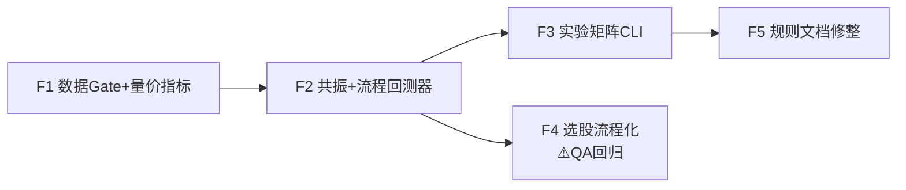

# 体系级流程回测重构 — 施工设计 v2（flow_redesign）

> 架构师：高见远（software-architect-2）· 2026-09-11
> 版本：v2.1（2026-09-11 晚：四分之三阴量线/顶部大风车闭环入档，离场层 7→9 级，负面信号不进共振分）· 上游：docs/t02_backtest_redesign.md（v1 组合层/网格/OOS 设计继续有效，本文不重复其内容）
> 状态：待评审 · 优先级 A > C > B > D
> 设计输入：用户 ahao 连续四条质疑（经 ima 知识库查证属实，全部采信），知识库规则文档（b1_rules.md / brick_rules.md / needle20_rules.md）已逐条核对源码。

---

# Part A · 回测实验设计（核心，先出即可开工）

## A0. 错版 → 正版：信号角色重定义映射表

本设计的地基。现行 `backtest.py::compute_signals()` 五路信号在正版体系中的角色：

| 信号 | 现行用法（错版） | 正版角色 | 处置 |
|------|----------------|---------|------|
| **B1** | 独立买点，全市场扫 | **流程入场点**（超跌首买，试错仓） | ✅ 保留信号定义，改消费方式 |
| **B2** | 独立买点 | **B1 确认加仓**（`b1_prev` 前提现行已对） | ✅ 保留；量倍数 1.5→纳入网格（知识库「倍量柱」≈2倍） |
| **B3** | 独立买点（`J≥80+5日涨8%` 全市场追加速，-36.1%） | **持有阶段状态**，非买点 | 🔴 删除独立买入逻辑，改为状态机转移条件 |
| **单针** | 独立买点，全市场扫「短≤20&长≥60」（-70.1%） | **补票信号**：仅持仓流程中激活，只做上升区间的自己持有的票，漏下去 3~5% 止损 | 🔴 删除全市场独立扫，改为流程内补票动作 |
| **砖型** | 独立买点（+10.3%，唯一不亏的） | **共振确认 + 离场管理**（买点侧共振 / 卖点侧红翻绿·4红砖减仓）；可单独用但胜率依赖共振数 | 🟡 保留独立信号作 E1 对照组；流程内作共振项+离场项 |
| **MACD**（`macd_analysis.py` 已实现，回测 0 引用） | 未接入 | **环境层**（DIF>0 定多空）+ 共振项（顺周期/底背离）+ 离场项（顶背离/金叉空） | 🟢 本次接入 |

**冻结边界不变**：`backtest.py` 只读。flow_backtest 通过 `import` 消费 `compute_signals / needle20_lines / brick_chart`，**不修改任何函数**。B3 的"删除"是消费端不把它当买点，不是改内核。

## A1. 实验矩阵（直接回答用户两个问题）

用户要验证：①「砖型单独用 vs 共振用」②「依据（共振指标）越多胜率越高」。

| 组 | 跑法 | 信号/逻辑 | 资金口径 | 目的 |
|----|------|----------|---------|------|
| **E1 砖型单独** | 现行独立砖型信号满仓轮动 | `compute_signals()["砖型"]` | 单战法满仓复利（现行口径） | 对照组。**直接引用错版基线报告（+10.3%），不重跑** |
| **E2 纯流程** | B1入场→B2加仓→B3持有，无共振过滤，无补票 | flow_backtest(resonance=off, needle=off) | tranche 权重 {B1:0.6, B2:0.4} | 流程基线（无共振时的真实水平） |
| **E3 共振分层** ⭐ | B1入场，按共振命中数 0/1/2/3+ **分层统计** | flow_backtest + resonance_score | 同 E2 | **直接验证"依据越多胜率越高"** |
| **E4 全流程** | 完整状态机：B1→B2→B3→单针补票→离场层 | flow_backtest(full) | tranche {B1:0.5, B2:0.3, 补票:0.2} | 正版收益估计；**补票止损 3% 与 5% 两档**各跑一次 |
| **环境开关 ×2** | 每组各跑「有无 MACD DIF>0 前置过滤」 | env_switch ∈ {on, off} | — | 量化环境层贡献（差值 = MACD 环境层价值） |

共 7 次有效回测（E1 引用 + E2/E3/E4 × env on/off 中 E3 只需 on 一档 + E4 两档止损），规模可控。

### E3 分层统计设计（本实验的灵魂）

- 共振指标集（6 项，见 B2）：`砖型翻红 / MACD顺周期(红柱升高+价涨) / 倍量柱 / MACD底背离 / 关键K / 缩量止跌(长阴短柱+地量)`
- 以 **B1 信号日（lag 防前视：用 T-1 及以前数据）** 计算命中数，分 4 桶：**0 / 1 / 2 / 3+**
- 每桶输出：交易数 / 胜率 / 盈亏比 / 平均单笔 / Calmar（IS 段与 OOS 段各一份）
- **单调性验收**：桶胜率须满足 3+ > 2 > 1 > 0（或 Spearman ρ ≥ 0.5），**且 OOS 段单调性不反转** → 用户假设「依据越多胜率越高」成立；否则如实报告失败

### 状态机定义（E2/E4 共用）

```
状态: EMPTY → HOLD_B1 → HOLD_B2 → HOLD_B3 → (回调时)HOLD_B1+补票 → 离场 → EMPTY

转移:
EMPTY   --B1信号 & 环境层通过-->        HOLD_B1     (试错仓 tranche_b1)
HOLD_B1 --B2信号(b1_prev+倍量确认)-->   HOLD_B2     (加仓 tranche_b2)
HOLD_B2 --5日涨≥8% & J≥80-->           HOLD_B3     (状态升级, 不新增资金)
HOLD_*  --白线≤20 & 红线≥60 (回调)-->   +补票仓     (限1次, tranche_needle, 止损3%/5%两档)
HOLD_*  --离场层任一触发-->             EMPTY       (全部 tranche 离场)
```

离场层优先级（从高到低，当日多触发按最高优先级计因；v2.1 更新：7 级 → 9 级，新增两个逃顶项）：
1. 盘中止损：跌破 B1 信号低点（B1 tranche）/ 跌破关键K低点（B2/B3 tranche）
2. 补票止损：漏下去 3%（档1）/ 5%（档2）
3. 红翻绿 / 红砖缩短：全部离场
4. **四分之三阴量线（S1 级逃顶预警，v2.1 新增）**：持仓中出现 → 减仓 30~50% 预警；若次日再收放量阴线确认 → 清仓离场（与顶部大风车的"确认口径"一致）
5. **顶部大风车（v2.1 新增）**：连续上涨后螺旋桨顶部（长上下影+小实体）；**确认 = 大风车 + 放巨量阴线（S1 确认级）→ 离场；大风车后右侧放量 = 逃**。未确认的孤立大风车 → 减仓预警
6. 连续 4 红砖：减仓 30~50%（`brick_rules.md:35-38` 原文，非清仓）
7. MACD 顶背离 / 金叉空预警
8. 白线有效跌破黄线（2 日确认，对齐现行 `_find_exit` 口径）
9. 跌破前低 / 到期（B1 30日 / B2 15日 上限沿用现行 rules）

> 优先级排序理由：4/5 两项是与「顶部大风车/S1 同档」的**形态级逃顶预警**（team-lead 建议同档，采纳），排在结构性减仓（6）之前、硬止损（1-2）与砖型直接反转信号（3）之后——因为它们是"高位见顶"语义，紧迫度高于动能衰减（4红砖）与指标背离（7）。

### 数据与切分

- 股票池：全市场缓存（team-lead 确认 5016 只已全量落库 2024-01~今）
  ⚠️ **施工 Gate-0**：开工首日跑缓存覆盖检查（`SELECT symbol, COUNT(*), MIN(date), MAX(date) FROM klines WHERE adjustment='qfq' GROUP BY symbol`），确认 ≥4800 只且 bars ≥250；不达标先补数，禁止带病开工（本机 shell 输出捕获今日故障，未能复核该数，务必实测）
- 区间 2024-01-01 ~ 今；IS/OOS = 60:40，**沿用 v1 §6.2 全套防护**（全局统一切点 / IS 尾部剔除 30 根 / OOS 交易数 <30 标 INSUFFICIENT_SAMPLE）
- 成本：`backtest.TRADE_COST`；指标口径：v1 §7（Sharpe/Calmar/WinRate/MaxDD/OOS-IS≥0.6）原样复用

### 实验报告输出形态

```json
{
  "version": "flow_v2",
  "baseline_ref": "data/backtest/<错版报告文件名>.json",
  "experiments": {
    "E1_brick_solo":  {"source": "baseline", "收益率%": 10.3},
    "E2_pure_flow":   {"env": "on",  "IS": {...}, "OOS": {...}},
    "E3_resonance":   {"buckets": {"0": {...}, "1": {...}, "2": {...}, "3+": {...}},
                       "monotonic_is": true, "monotonic_oos": true},
    "E4_full_flow":   {"needle_stop": 0.03, ...}, {"needle_stop": 0.05, ...}
  },
  "env_contribution": {"E2_off_minus_on": {...}}
}
```

控制台对比表（错版基线 vs 正版）逐战法并列，旧结果**原文件保留不动**，新报告引用 `baseline_ref`。

---

# Part C · 任务分解（5 个任务，≤5 硬上限）

| ID | 任务 | 文件 | 依赖 | 类型 | 预计改动 |
|----|------|------|------|------|---------|
| **F1** | **数据 Gate + 量价指标库** | `utils/vol_price.py`(新) + 缓存覆盖检查脚本(临时) | 无 | **纯新增** | **10 个**逐日指标（倍量柱/长阴短柱/缩量到地量/红肥绿瘦/反包/关键K/放量缩量回调/缩量阴线价升 8 个 + v2.1 四分之三阴量线/顶部大风车 2 个）+ 单测（用 600519 缓存数据人工核对 3 个样本日；`three_quarter_yin_volume` 单测须含 D1 阳线+D2 带宽内/外阴量两例） |
| **F2** | **共振评分 + 流程回测器** | `utils/resonance.py`(新) `utils/flow_backtest.py`(新) | F1 | **纯新增** | 6 项共振矩阵 + 状态机 + FlowTrade 三段 tranche 记录；单测：构造 20 根合成 K 线覆盖全部状态转移 |
| **F3** | **实验矩阵 CLI** | `utils/market_backtest.py`(改) | F2 | **改造（仅加分支）** | `--flow`/`--exp` 子模式 + E1 引用基线 + JSON 报告；既有 `run_backtest_market/summarize/equity_curve` 签名不动 → **QA 只需回归旧命令 `--max-stocks 50`** |
| **F4** | **选股策略流程化** | `utils/sim_screener.py`(改) `utils/midday_sim.py`(改) | F2 | ⚠️ **行为变更，QA 必须回归** | 四组并列 → 流程视图（见 B4）；**保留 GROUPS 兼容读取方**；模拟盘 3 只持仓输出流程建议 |
| **F5** | **规则文档修整** | `utils/experts/modules/*.md`(改) | F3 实验结论 | 文档 | 清单见 B5 |

依赖链：F1 → F2 → F3（主线）；F2 → F4；F3 结论 → F5。F4 与 F3 可并行。



**各任务验收标准**：

- **F1**：`vol_price` 每个函数对 600519 某放量日/缩量日的 bool 输出与人工判读一致；红肥绿瘦用 `b1_rules.md:84` 的「14天阳量/阴量>1.65」口径复算一例
- **F2**：状态机单测覆盖 EMPTY→B1→B2→B3→补票→离场全路径 + 「B2 无 B1 前提不触发」「补票限 1 次」两个守卫；资金守恒（tranche 现金收支闭合）
- **F3**：`--exp` 一次跑完输出 A1 报告 JSON；E3 单调性字段自动计算；旧命令回归通过
- **F4**：输出含「流程建议」字段；600660/600487/688218 三只持仓的流程状态正确（不丢、不自动交易）；`GROUPS` 常量与返回结构对下游兼容
- **F5**：见 B5 清单逐项勾验

---

# Part B · 模块设计

## B1. `utils/vol_price.py` — 量价指标集（图形买点体系词汇表代码化）

全部为**逐日 bool/float Series**，函数签名统一 `(df: pd.DataFrame, ...) -> pd.Series`，知识库依据写入 docstring：

| 函数 | 定义（可施工口径） | 知识库依据 |
|------|------------------|-----------|
| `heavy_volume_bar(df, mult=1.8)` | `V > MA(V,20)*mult` 或 `V > V_prev * 2` | 「倍量柱：单/双根量显著放大+暴力K」。mult 进网格 [1.5, 1.8, 2.0, 2.5]（B2 现行 1.5 偏宽松） |
| `long_yin_short_zhu(df)` | `跌幅>3% & V < MA(V,20)*0.7` | 「长阴短柱：长阴但量萎缩（恐慌盘被打掉、主力未出）」 |
| `shrink_to_floor(df)` | `V < MA(V,20)*0.5` 或 `V ≤ 近60日10%分位` | 「连续缩量下跌→地量」 |
| `red_fat_green_thin(df, n=14)` | 近 n 日阳量合计/阴量合计 > **1.65**（b1_rules.md:84 原文口径） | 「红肥绿瘦/红瘦绿肥：持仓健康度」 |
| `reversal_engulf(df)` | 阳线实体完全覆盖前阴实体 | 「反包：阳线完全覆盖前阴实体（灾后重建）」 |
| `key_k(df)` | 前高/黄线关键位 + 大阳（实体>4%）或涨停；止损=跌破该K低点 | 「关键K：关键位大阳/涨停=大资金入场」 |
| `volume_shrink_pullback(df)` | 近10日有 `V > MA(V,20)*2.5` 巨量，其后回调段 `V < MA(V,20)*0.8` | 「放巨量后缩量回调=健康可持有；平量/次高点密集放量=出货离场」（后者做 `top_heavy_volume()` 反向指标供离场层） |
| `shrink_yin_up(df)` | 收盘价升 & 阴线 & 缩量 | 「缩量阴线+收盘价上升=强势」 |
| `three_quarter_yin_volume(df, mult=1.8, ratio_lo=0.65, ratio_hi=0.85)`（v2.1 新增） | **D1** 放量阳线（红柱）：`量 > MA(V,5)×mult`；**D2** 次日阴线且 `量(D2) ≈ 量(D1)×3/4`（带宽参数化 `ratio_lo~ratio_hi`，默认 0.65~0.85）。信号在 **D2 收盘** 触发。`mult` 与带宽进网格（mult 1.5~2.5） | **用户口述 + 知识库佐证**（见下框） |
| `top_windmill(df)`（v2.1 新增） | 连续上涨（近 5 日 ≥3 阳或累计涨幅 >10%）后螺旋桨顶部：上影与下影各 ≥ 实体 2 倍 + 小实体（实体 <2%）。确认变体 `top_windmill_confirmed` = 大风车 + 次日放巨量阴线（量 > MA(V,20)×2） | 黑话全解密词条「顶部大风车：连续上涨后」；确认口径「大风车+放巨量阴线（S1 确认）；大风车后右侧放量=逃」 |

**「四分之三阴量线」口径入档（v2.1 闭环，原"待用户确认"项）**

> **用户口述原话（原话入档，未润色）**：
> 「四分之三阴量线是**量的图不是k线**，指的是**放大量红柱第二天是3/4的阴量柱**，可能是逃顶信号？或者假突破？我就记得这么多」

代码化口径（主理人整理，按此施工）：
- **D1**：放量阳线（红柱，量 > 5日均量 × mult，mult 网格 1.5~2.5）
- **D2**：次日阴线，且 `量(D2) ≈ 量(D1) × 3/4`（比例带宽参数化，默认 0.65~0.85，进网格）
- **语义**：放量上攻（主力真买）次日即遭 3/4 高位量的阴线反扑 → 抛压重 → **走坏 / 假突破 / 逃顶预警**
- **知识库佐证**：「标准四分之三阴量线**宣告走坏**」（2026-03-15 直播原文）；《知行交易模块.png》全景图「阴量线」为正式组件
- **与健康口径的互补关系（设计要点）**：知识库「放巨量后**缩量**回调 = 健康」与本形态构成**两档判别**——回调阴量 ≈1/4 量 = 健康（可持有）；≈3/4 量 = 走坏（逃顶预警）。实现上 `volume_shrink_pullback`（≈1/4 档）与 `three_quarter_yin_volume`（≈3/4 档）共享 D1 前置条件，仅 D2 量比带宽不同，建议同函数族实现避免口径漂移
- **用途定位两处**：① **离场层**第 4 级：持仓中出现 → S1 级逃顶预警（与顶部大风车同级）；② **选股过滤**：候选股刚出现该形态 → 假突破，B1 信号质量打折/不买（见 B4）
- **注意**：用户口述「量的图不是K线」——这是**量柱形态**（成交量维度）而非K线实体形态，实现只依赖 volume 与阴/阳（收盘 vs 开盘），不依赖影线

## B2. `utils/resonance.py` — 共振评分

```python
RESONANCE_ITEMS = ["砖型翻红", "MACD顺周期", "倍量柱", "MACD底背离", "关键K", "缩量止跌"]

def resonance_matrix(df: pd.DataFrame) -> pd.DataFrame:
    """逐日 × 6 项布尔矩阵。各源: brick_chart翻红 / macd顺周期(红柱升高+价涨,
    复用 macd_analysis.py 的 DIF/DEA/柱计算) / vol_price.heavy_volume_bar /
    macd底背离 / vol_price.key_k / (long_yin_short_zhu | shrink_to_floor)"""

def score_at(matrix: pd.DataFrame, date, lag: int = 1) -> tuple[int, list[str]]:
    """取 date-lag 日命中数与命中项列表（防前视）。"""

def bucket(score: int) -> str:  # "0" / "1" / "2" / "3+"
```

权重设计：**等权计数，不加权**。理由：b1_rules.md:72-76 原文「各信号独立触发、独立参考，叠加越多只代表胜率倾向更高，不是必要条件」——E3 实验本身就是验证计数单调性，加权会污染实验。

**负面信号不进共振分（v2.1 确认）**：`three_quarter_yin_volume`（走坏）、`top_windmill`（见顶）、红瘦绿肥、次高点密集放量等**负面/离场信号一律不纳入 RESONANCE_ITEMS 计分**，只做离场层触发与选股过滤。理由（架构师确认 team-lead 判断正确）：E3 的实验假设是「正向确认依据越多 → 胜率越高」，共振分语义必须是"买入理由的累加"；混入负面信号会把"该买的票"和"该躲的票"混进同一计数轴，直接破坏分层单调性检验的有效性。负面信号的价值通过离场层（E4）与选股过滤（F4）单独验证。

## B3. `utils/flow_backtest.py` — 流程回测器（状态机）

```python
class FlowState(Enum):
    EMPTY; HOLD_B1; HOLD_B2; HOLD_B3

@dataclass
class FlowConfig:
    env_macd_filter: bool = True      # 环境层: DIF>0 + 白线>黄线 + (活跃市值择时, 可选)
    resonance_on: bool = False        # E2=False / E3,E4=True
    needle_patch: bool = False        # 补票开关(E4=True)
    needle_stop_pct: float = 0.05     # 3% / 5% 两档
    needle_max_count: int = 1         # 每轮流程补票上限(知识库未明说次数 → 默认1, 待用户确认)
    tranche: dict = field(default_factory=lambda: {"B1": 0.6, "B2": 0.4, "needle": 0.0})
    b2_vol_mult: float = 1.8          # 倍量柱网格参数
    max_hold: dict = field(default_factory=lambda: {"B1": 30, "B2": 15})

@dataclass
class FlowTrade:
    code: str; name: str
    b1_signal_date: str; b1_entry_date: str; b1_entry_price: float
    b2_entry_date: str | None; b2_entry_price: float | None      # tranche 独立记
    needle_entry_date: str | None; needle_entry_price: float | None
    exit_date: str; exit_reason: str
    tranches: list[dict]      # 每段 {kind, qty_w, entry, exit, pnl_pct}
    resonance_bucket: str     # "0"/"1"/"2"/"3+"  ← E3 分层键
    regime_entry: str         # 大盘状态(lag=1, 沿用 v1 market_regime)

def run_flow_backtest(df, code, name, cfg: FlowConfig, rules) -> list[FlowTrade]:
    """单标的流程状态机。
    信号源(全部只读复用冻结内核):
      signals = backtest.compute_signals(df)      # B1/B2 信号直接消费
      lines   = needle20.needle20_lines(df)       # 补票条件 短≤20 & 长≥60
      brick   = brick.brick_chart(df)             # 翻红/翻绿/红砖序列
      macd    = 内嵌计算(macd_analysis 同口径)     # DIF/DEA/柱
    注意: signals["B3"] 消费端弃用(不作买点); signals["单针"] 弃用(全市场版), 用 lines 现算补票条件。
    """
```

**前视防护**：所有当日判定（共振分/环境层/补票条件）只用 T-1 及以前指标值，买卖价用 T 日开盘（与现行「信号日次日开盘买入」口径一致）。

**组合层关系**：flow_backtest 输出**事件级交易**（FlowTrade），资金分配仍由 v1 的 `portfolio_backtest.py` 调度（`tranche` 权重只决定单只内部三段的比例，组预算/25万/单只50% 由 PortfolioConfig 管）——两层解耦，v1 成果不废。

## B4. 选股策略流程化改造

现状：`sim_screener.py` `GROUPS = ["B1组","砖型组","单针组","深V组"]` 四组并列海选；`midday_sim.py` 按组买进模拟盘。

改造（保持兼容的增量式）：

1. `sim_screener.py`：
   - **保留** `GROUPS` 常量与 `screen_by_code()` 返回结构（下游 midday_sim/自动化任务在用，硬切会崩）
   - **新增** `screen_flow(top_n)` → 流程视图：B1 初筛（沿用 rough_screen B1 池）→ `resonance_matrix` 打分排序 → 输出 `[{代码,名称,最新价,共振分,命中明细,建议动作}]`
   - 建议动作映射：B1信号+共振 →「B1试错建仓」；已持有票出现B2信号 →「B2加仓」；持有票出现补票条件 →「单针补票(止损X%)」；仅持仓票输出
   - **负面形态过滤（v2.1 新增）**：候选股刚出现 `three_quarter_yin_volume`（四分之三阴量线）→ 标「假突破/走坏嫌疑」，B1 信号质量降级——从候选池剔除或 score 减 2 档，**不进入推荐**；出现孤立 `top_windmill` → 同样降级并标注
2. `midday_sim.py`：
   - 主流程改读 `screen_flow()`；四组并列逻辑降级为兼容模式（`--legacy` 开关保留一轮）
   - **模拟盘现有持仓兼容（硬要求）**：对 600660/600487/688218 逐只输出「当前流程状态（B1持有/B2持有/B3主升）+ 今日建议」，**只建议不自动交易**，防流程切换当日误操作
3. `sim_portfolio.py` 分组语义：B1组/砖型组/单针组/深V组 → 建议改为「流程仓（B1试错/B2加仓/补票）」三段，**但本期不动 sim_portfolio 账户结构**（改名涉及 sim_account.json 迁移，另行立项），仅筛选/建议侧流程化

## B5. 规则文档修整清单（`utils/experts/modules/`）

| 文件 | 改什么 | 依据 |
|------|--------|------|
| `needle20_rules.md` | 新增「补票战法定位」章节：第四阶段补票（B1→B2→B3 之后），**非独立选股器**；只做上升区间的自己持有的票；漏下去 3~5% 止损；全市场独立扫描为错版用法 | ima 质证原文 |
| `b1_rules.md` | §六执行流程与 flow_backtest 状态机对齐（加状态转移图）；B2 量能口径标注「1.5 为现行宽松值，倍量柱 ≈2，网格 [1.5,2.5]」 | b1_rules.md:117 现行 1.5 |
| `brick_rules.md` | 基本不动（原文已对齐知识库）；补「共振评分中的角色：买点侧翻红确认 / 卖点侧4红砖减仓·红翻绿」一段 | brick_rules.md:35 |
| `market_value_rules.md` | 确认活跃市值择时为环境层第 3 项（与白>黄、DIF>0 并列） | 体系架构环境层 |
| **新增** `flow_rules.md` | 流程总纲：环境层（活跃市值+白>黄+DIF>0）/ 流程层（B1→B2→B3→补票）/ 共振层（6 项正向计分，负面信号明确不进分）/ 离场层（9 级优先级，含四分之三阴量线、顶部大风车） | 本设计 A1 |
| 全部 | 「3/4阴线」相关引用已全部替换为「四分之三阴量线」正式口径（用户口述+知识库佐证，见 B1）；如工程师发现残留旧表述，以 B1 口径框为准 | v2.1 闭环 |

---

# Part D · 风险与兼容

| # | 风险/兼容项 | 等级 | 处置 |
|---|-----------|------|------|
| D1 | **错版基线保留**：现行回测报告（含砖型 +10.3%、单针 -70.1% 等）是宝贵对照 | 🟡 | `data/backtest/` 旧文件**不改名不删除**；新报告 `version: flow_v2` + `baseline_ref` 引用；控制台对比表并列展示 |
| D2 | **冻结内核边界**：flow_backtest 不得改 `backtest.py` | 🔴 | 只 import 消费；`compute_signals` 的 B3/单针序列在消费端**弃用并注释原因**；QA 断言 `git diff utils/backtest.py` 为空（沿用 v1 A9） |
| D3 | **缓存覆盖未复核**：5016 只全量落库是 team-lead 口头结论，本机 shell 故障未能实测 | 🟡 | **Gate-0**：F1 首日跑覆盖检查（≥4800 只 & ≥250 bars），不达标先补数 |
| D4 | **选股/模拟盘行为变更**：midday_sim 自动化任务每天在跑 | 🔴 | F4 为 QA 强回归项；`--legacy` 兼容开关保留一轮；**切换日前先跑 3 天 dry_run 双轨对比** |
| D5 | **自动化任务 prompt 语义过期**：任务 prompt 中「B1组/砖型组/单针组/深V组」四组并列的说法在流程化后语义变化 | 🟡 | F4 合入后由 team-lead 同步更新自动化任务 prompt（改流程视图说法）；本期 sim_portfolio 账户分组名不动，故 prompt 改动范围可控 |
| D6 | **补票次数上限无知识库依据**：`needle_max_count=1` 是架构假设 | 🟡 | 进 FlowConfig 可配；「待用户确认」清单列明；可作敏感性对比（1 次 vs 2 次） |
| D7 | **B3 状态转移判据弱**：`5日涨8%+J≥80` 沿用现行阈值，作"状态升级"是否合理未经验证 | 🟢 | 仅影响 tranche 管理不影响买入（B3 不新增资金），风险有限；阈值进后续网格 |
| D8 | **环境层择时数据**：活跃市值 CSV（2024 前数据有限）与 DIF>0（逐股可算）覆盖不同 | 🟢 | 环境层默认只用 白>黄 + DIF>0（逐股、全区间可算）；活跃市值择时作可选叠加（缺数据日放行并标注） |
| D9 | **E1 引用的 +10.3% 基线口径**：满仓轮动复利 vs 流程口径不可直接比 | 🟡 | 对比表**只并列展示不硬比 Calmar**；如需同口径对比，用 v1 组合层把砖型单独信号也跑一遍（P2 可选） |

**待用户确认清单**（汇总，转 PM/用户；v2.1：第 1 项已闭环）：
1. ~~「3/4阴线」精确定义~~ ✅ **已闭环（2026-09-11）**：用户口述定义已入档并代码化为 `three_quarter_yin_volume`（见 B1 指标表下方口径框）
2. 单针补票每轮流程限 1 次是否符合原意
3. 补票止损两档 3%/5% 是否对应「3~5 个价位」的原意（本设计按百分比口径实现）
4. sim_portfolio 账户分组改名（B1组/砖型组…→ 流程仓三段）是否立项（涉及 sim_account.json 迁移）
5. 四分之三阴量线的 D2 量比带宽（0.65~0.85）与 mult 网格值为架构拟定，用户如记得更精确口径（如"接近3/4"的容差）可收敛网格

---

## 附：设计依据核验记录

| 结论 | 依据 |
|------|------|
| b1_rules.md:133「连续4红砖减仓；红翻绿短线止盈」 | 已读原文，逐字核对 |
| 红肥绿瘦量化：14天阳量/阴量>1.65、回调量萎缩至前量50%以下 | b1_rules.md:84-90 |
| B1 五大条件含「砖型图绿翻强红」「红肥绿瘦」 | b1_rules.md:26-30 |
| 「各信号独立触发…叠加越多胜率倾向更高」 | b1_rules.md:72-76（等权计分依据） |
| 砖型 4 红砖减仓 30-50%（非清仓） | brick_rules.md:35-38 |
| 单针四大信号与「禁止单独使用」优先级 | needle20_rules.md / needle20.py:20 |
| MACD 三层（零轴/顺周期/背离+金叉空） | macd_analysis.py 已实现全部三层 |
| B2 现行 vol 1.5 倍 | backtest.py:117 |
| 流程化后 GROUPS 消费方 | sim_screener.py:GROUPS / midday_sim.py import GROUPS |
| 现行持仓兼容对象 600660/600487/688218 | team-lead 任务书 |
| 四分之三阴量线：用户口述原话 +「标准四分之三阴量线宣告走坏」（2026-03-15 直播）+《知行交易模块.png》阴量线组件 | v2.1 更新，原话入档见 B1 |
| 顶部大风车：黑话全解密词条「顶部大风车:连续上涨后」；确认=大风车+放巨量阴线（S1 确认）；大风车后右侧放量=逃 | v2.1 更新 |
| 负面信号不进共振分 | v2.1 架构师与主理人一致确认（E3 实验有效性前提） |
