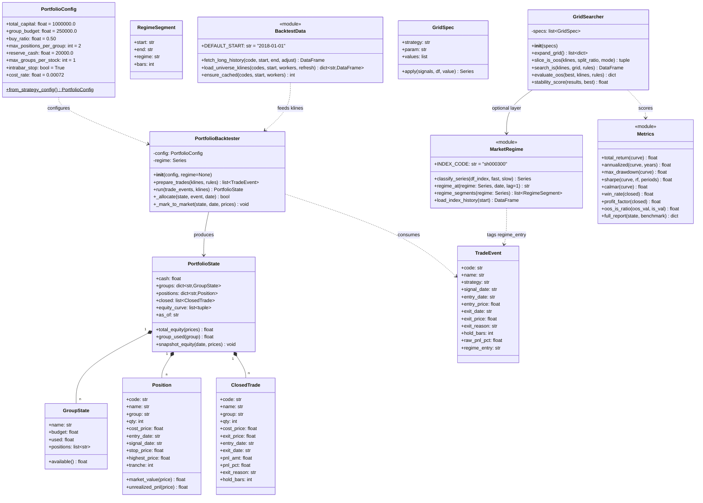
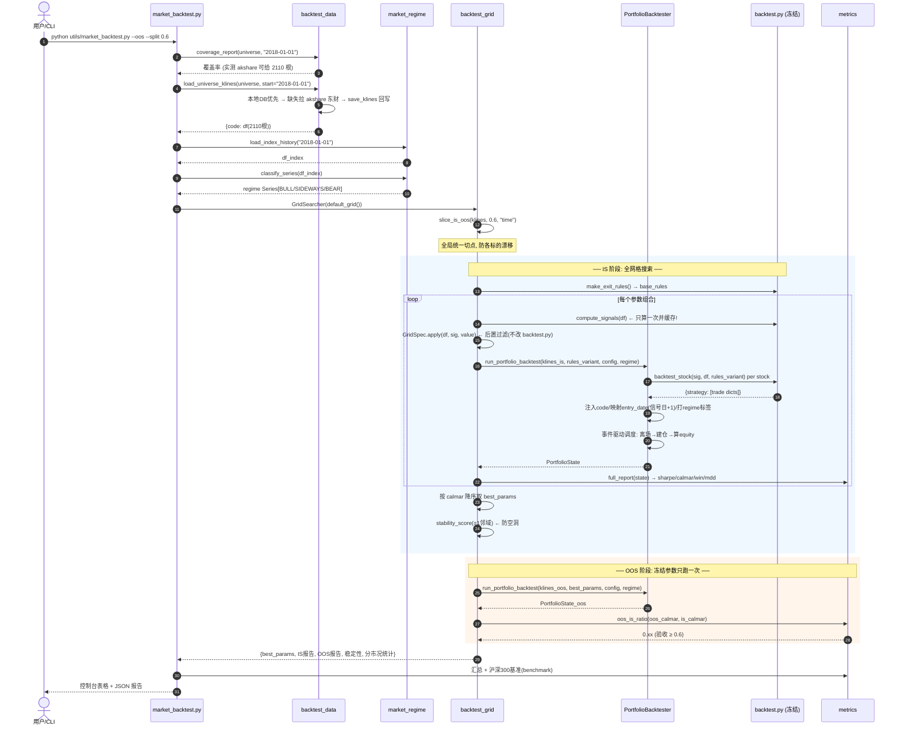
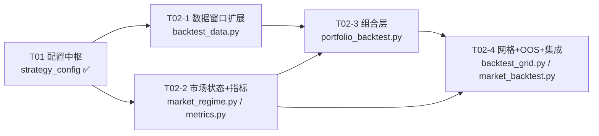

# T02 回测底座重构 — 施工级系统设计

> 架构师：高见远（software-architect-2）
> 版本：v1.0 · 状态：待评审
> 范围：**只做设计，不含实现**。所有结论均已在 `D:\Codes\workspace\ahao-stock-agent` 实测验证，附验证命令与实测输出。

---

## 0. 前置问题（team-lead 指定必须先答）

### 0.1 `backtest_stock()` 的输入输出契约（实测）

**实测命令**

```bash
./.venv/Scripts/python.exe -c "
import sys; sys.path.insert(0,'.')
import pandas as pd, json
from utils.backtest import compute_signals, backtest_stock, make_exit_rules
from utils.kline_cache import load_klines
df = load_klines('600519'); df = df[df.index >= pd.Timestamp('2024-01-01')]
sig = compute_signals(df)
res = backtest_stock(sig, df, rules=make_exit_rules())
print(list(res.keys()); print(res['B1'][0])
"
```

**实测输出**

```
bars: 634
compute_signals -> <class 'dict'> keys= ['B1','B2','B3','砖型','单针']  value type= pandas.Series
signal counts: {'B1': 55, 'B2': 0, 'B3': 0, '砖型': 29, '单针': 21}

backtest_stock -> <class 'dict'> keys= ['B1','B2','B3','砖型','单针']
B1 trade count: 28
FIRST TRADE RECORD keys: ['日期','买入','卖出','收益','持有','原因']
sample record: {"日期":"2024-10-17","买入":1389.46,"卖出":1389.87,"收益":-0.04,"持有":1,"原因":"止损"}
```

**契约固化（组合层必须按此对接）**

```python
# 输入
compute_signals(df: pd.DataFrame) -> dict[str, pd.Series]        # df 需 DatetimeIndex + open/high/low/close/volume
backtest_stock(signals: dict[str, pd.Series],
               df: pd.DataFrame,
               rules: dict | None = None) -> dict[str, list[dict]]
make_exit_rules() -> dict[str, dict]                             # {战法名: {kind, max_hold, stop_pct?, desc}}

# 输出（关键！）
# result[strategy] = list[trade]，trade 为 **扁平 dict，6 个键，全部是"标量"**：
#   {"日期": str "YYYY-MM-DD"  ← 信号日(非买入日!),
#    "买入": float 2位  ← 次日开盘价,
#    "卖出": float 2位,
#    "收益": float 2位  ← 已扣 TRADE_COST 的单笔百分比(如 -0.04 表示 -0.04%),
#    "持有": int       ← exit_idx - buy_idx + 1,
#    "原因": str}      ← "止损"/"前高止盈"/"破白线离场"/"到期离场"/"白线破黄线止损"...
```

**⚠️ 契约陷阱（三个，组合层设计必须处理）**

| # | 陷阱 | 证据 | 影响 |
|---|------|------|------|
| A | **无股票代码字段**。`trade` 里没有 `code`，`backtest_stock` 是"单标的"级函数，不知道自己在跑谁 | `backtest.py:283-285` 只写 日期/买入/卖出/收益/持有/原因 | 组合层**必须自己按 `{code: df}` 逐只调用、逐只打标 `code`**，否则多标的交易混在一起无法分配资金 |
| B | **`日期` 是信号日，不是买入日**。买入在 `buy_idx = i+1` | `backtest.py:273-274`：`buy_idx = i + 1`，但写入的 `"日期": str(df.index[i])` | 组合层的**现金流/占用日历必须以"信号日+1"为买入日**；直接拿 `日期` 当买入日会错一天 |
| C | **`收益` 已扣成本、且是百分比数值**（`-0.04` = -0.04%），不是小数、不是绝对金额 | `backtest.py:44, 282`：`pnl = (exit_price-buy_price)/buy_price - TRADE_COST`，`round(pnl*100, 2)` | 组合层算**金额盈亏**必须用 `买入/卖出` 价反算：`pnl_amt = qty*(卖出-买入) - cost`；**不能**拿 `收益%` 乘资金（因为它是"满仓百分比"，不是"这笔占组合的收益"） |

**结论**：`backtest_stock()` 可**原样复用**为"信号→交易事件生成器"，但组合层要做三件事：
1. 逐标的调用并注入 `code`；
2. 以 `信号日+1` 建立买入日历；
3. 用 `买入/卖出` 价 + 自己的 qty 重算金额盈亏，**只复用 `收益` 做单笔质量统计，不复用做组合收益**。

---

### 0.2 ⚠️ 数据窗口验证（可能让 T02 翻车的前提 — 已实测）

**team-lead 的担忧成立，但根因不是数据源，是硬编码。**

`utils/screen_bull.py::fetch_kline()` 把日期**写死**了：

```python
df = ak.stock_zh_a_hist(symbol=code, period="daily",
                        start_date="20250101",   # ← 写死
                        end_date="20261231", adjust="qfq")
# 兜底1 新浪、兜底2 腾讯 也是同一组写死日期
```

**实测证据**

| 路径 | 请求 | 实得 | 区间 |
|------|------|------|------|
| `fetch_kline('600519', bars=800)` | 800 | **411** | 2025-01-02 → 2026-09-10（1.7 年） |
| `fetch_kline('600519', bars=3000)` | 3000 | **411**（忽略 bars） | 同上 |
| 本地 `kline_cache.db` qfq | — | 每只 ~700 | 2023-09-21 → 2026-08（2.9 年） |
| 缓存过滤 `>=2024-01-01` | — | **634** | 2024-01-02 → 2026-08-14（**≈2.6 年**） |
| **`ak.stock_zh_a_hist(start_date='20180101')`** | — | **2110** | **2018-01-02 → 2026-09-10（8.7 年）** |

**判决**

- ❌ **在现有 `START="2024-01-01"` + `count=700` 口径下，样本外切分不可行。** 634 根日K ≈ 2.6 年（注意：不是 1 年 —— `count=700` 从腾讯拉的是 700 根，起点 2023-09，`START` 截掉 2023 后剩 634 根）。若按 70/30 切，OOS 仅 ~190 根（0.78 年），**单战法 OOS 交易数会掉到个位数**，统计上毫无意义（`B1` 在 634 根上只有 28 笔）。
- ✅ **数据源本身完全够用。** akshare 东财一次给 2110 根（8.7 年），指数给 5990 根（2002 年起）。**限制是项目自己写死的 `start_date="20250101"` 和 `count=700`。**

**替代方案（三选一，本设计采用方案 A，B 作并行验证）**

| 方案 | 做法 | IS/OOS 可行性 | 成本 | 采用 |
|------|------|--------------|------|------|
| **A. 放宽 akshare 起止日期** | 新增 `utils/backtest_data.py`，绕开 `fetch_kline` 的写死日期，直连 `ak.stock_zh_a_hist`，可拉 2018 起 | ✅ 60/40 → IS 5.2 年 / OOS 3.5 年 | 需新建数据层，注意限流（东财需 `_clear_proxy` + `_random_delay`） | **主方案** |
| **B. 本地 DB 扩量** | 用 A 的拉取结果**回写** `kline_cache.db`（表结构已支持任意长度，`save_klines` 无上限） | ✅ 同上，且二次运行零网络 | 首次拉取慢，DB 涨到 ~100MB | **落盘方案（与 A 合并）** |
| **C. 降频到周线** | 日线 634 → 周线 ~130 根 | ❌ 更差，且战法是日线口径，换周期等于换战法 | — | **否决** |

**关键设计决定**：
> **T02 必须新建数据层 `utils/backtest_data.py`，把回测数据窗口从 `2024-01-01` 放宽到 `2018-01-01`（可配），并把拉取结果持久化进 `kline_cache.db`。**
> 不做这一步，`--oos` 子模式无意义，T02 会翻车。**这是 T02 的第一阻塞项，优先级等同 T01。**

---

## 一、实现思路（Implementation Approach）

### 1.1 核心技术难点

| 难点 | 说明 | 解法 |
|------|------|------|
| **D1 组合层 vs 单标的层语义差** | `backtest_stock` 是"每笔独立满仓"语义；组合层要"共享 25 万预算 + 现金约束 + 排队" | 新增**事件驱动调度层**：把各标的交易事件汇总成时间轴事件流，逐日推进组合状态机 |
| **D2 参数网格 × 组合回测的性能** | 5 战法 × 多参数 × 1000 标的 × 8 年，朴素实现 O(10⁵) 次回测 | **信号矩阵预计算**（`compute_signals` 只跑一次）+ 网格只重跑"离场规则"；`backtest_stock` 支持规则注入 |
| **D3 信号函数不可参数化** | `compute_signals()` 里 `J<=13`、`chg>4`、`v>1.5×` 等阈值**写死在函数体内**，网格无法调 | **不改 `backtest.py`**（架构约束）→ 在 `backtest_grid.py` 内做**信号后置过滤**：对已算出的信号序列按参数重筛 |
| **D4 样本外过拟合** | 对标项目教训：回撤 17.4% → 60.2% | **IS/OOS 硬隔离 + 参数稳定性检验**（邻域平稳性，非单点最优） |
| **D5 市场状态分层** | 需按 BULL/SIDEWAYS/BEAR 分别统计，否则牛市收益掩盖熊市亏损 | 独立 `market_regime.py`，用**沪深300（长历史）**做状态标签，**前视偏差防护**（用 T-1 状态） |

### 1.2 技术选型

| 选择 | 理由 |
|------|------|
| **不引入新框架**（无 backtrader/vectorbt/zipline） | 现有 `backtest.py` 是"经项目验证的资产"（架构约束）；战法离场逻辑高度定制（白线/黄线/砖型/单针），通用框架反而要写适配器。依赖最少 = 最稳 |
| **沿用纯 pandas + numpy** | 项目既有风格，零学习成本 |
| **事件驱动（非向量化）组合调度** | 组合层的"预算/现金/持仓上限"是**强序贯约束**，向量化会失真（真实资金分配是路径依赖的） |
| **akshare 东财为主数据源** | 实测可给 2110 根；mootdx 411 根不足；腾讯 700 根不足 |
| **`kline_cache.db`（SQLite）做结果持久化** | 表结构无长度限制，`save_klines` 直接可用，零改造成本 |
| **`dataclasses` 定义状态** | 与 `strategy_config.py` 风格一致，零依赖，可 `asdict()` 序列化 |

### 1.3 架构模式

**分层事件驱动（Layered Event-Driven）**

```
┌─ L4 报告层 ── market_backtest.py (--grid/--portfolio/--oos 子模式) + metrics.py
├─ L3 搜索层 ── backtest_grid.py（参数网格 + IS/OOS 切分 + 稳定性检验）
├─ L2 组合层 ── portfolio_backtest.py（资金分配状态机）
├─ L1 状态层 ── market_regime.py（市场状态分层）
├─ L0 数据层 ── backtest_data.py（长历史拉取 + 缓存）  ★新增，解决 D0.2
└─ 底座(冻结) ── backtest.py: make_exit_rules / compute_signals / backtest_stock  ← 只读复用
```

---

## 二、文件清单

### 2.1 新建（4 个）

| 文件 | 职责 | 行数估算 |
|------|------|---------|
| `utils/backtest_data.py` | **长历史数据层**：绕开 `fetch_kline` 写死日期，支持 `start` 配置；拉取→校验→写 `kline_cache.db`；批量并发 | 180 |
| `utils/market_regime.py` | **市场状态分层**：BULL/SIDEWAYS/BEAR 标签序列 + 前视安全访问 | 130 |
| `utils/portfolio_backtest.py` | **组合层回测**：账户/持仓/现金/预算状态机，事件驱动调度 | 320 |
| `utils/backtest_grid.py` | **参数网格 + IS/OOS**：信号后置过滤、网格搜索、稳定性检验、指标汇总 | 300 |

### 2.2 改造（1 个，仅加子命令，不动既有函数）

| 文件 | 改造内容 |
|------|---------|
| `utils/market_backtest.py` | `main()` 增加 `--grid` / `--portfolio` / `--oos` 三个子模式分支；`fetch_klines` 改用 `backtest_data`；**`run_backtest_market` / `summarize` / `equity_curve` / `get_benchmark` 保持签名不变** |

### 2.3 冻结（不改）

| 文件 | 约束 |
|------|------|
| `utils/backtest.py` | **禁止修改**。只调用 `make_exit_rules()` / `compute_signals()` / `backtest_stock()` |
| `utils/strategy_config.py` | 只读 `CONFIG`（`GROUP_BUDGET=250000`, `BUY_RATIO=0.50`, `RESERVE_CASH=20000`） |

---

## 三、数据结构与接口（Mermaid classDiagram）



---

## 四、核心接口签名（可施工级）

### 4.1 `utils/backtest_data.py`

```python
DEFAULT_START = "2018-01-01"

def fetch_long_history(code: str, start: str = DEFAULT_START,
                       end: str | None = None, adjust: str = "qfq") -> pd.DataFrame | None:
    """直连 akshare 东财拉长历史（绕开 screen_bull.fetch_kline 的写死日期）。
    返回 DatetimeIndex + [open, high, low, close, volume, amount] 升序；失败返回 None。
    实测: 600519 @2018-01-01 → 2110 根。
    """

def load_universe_klines(codes: list[str], start: str = DEFAULT_START,
                         workers: int = 4, refresh: bool = False) -> dict[str, pd.DataFrame]:
    """批量加载：本地 DB 优先（且已覆盖 start）→ 缺失部分拉取 → 回写 DB。
    refresh=True 时强制重拉。返回 {code: df}。
    """

def ensure_cached(codes: list[str], start: str = DEFAULT_START,
                  workers: int = 4) -> int:
    """确保 codes 的 DB 缓存覆盖 [start, today]，返回新写入根数。
    ⚠️ 写库用 utils.kline_cache.save_klines（表无长度上限，已实测 700 根可写）
    """

def coverage_report(codes: list[str], start: str = DEFAULT_START) -> pd.DataFrame:
    """诊断: 每只的 bars / 起始日 / 是否满足 start。用于开工前体检。"""
```

### 4.2 `utils/market_regime.py`

```python
BULL, SIDEWAYS, BEAR = "BULL", "SIDEWAYS", "BEAR"
INDEX_CODE = "sh000300"   # 实测 5990 根 (2002 起)

def load_index_history(start: str = "2018-01-01") -> pd.DataFrame:
    """沪深300 日线。主: akshare stock_zh_index_daily；兜底: 本地缓存。"""

def classify_series(df_index: pd.DataFrame, fast: int = 20, slow: int = 60) -> pd.Series:
    """逐日状态标签。规则（★前视安全：只用 t 及以前数据）:
        close_t > MA_slow_t 且 MA_fast_t > MA_slow_t   → BULL
        close_t < MA_slow_t 且 MA_fast_t < MA_slow_t   → BEAR
        其余                                             → SIDEWAYS
    返回 index 对齐的 Series[dtype=object]。
    """

def regime_at(regime: pd.Series, date: str | pd.Timestamp, lag: int = 1) -> str:
    """取 date 的状态，lag=1 表示取前一交易日（防前视偏差）。
    找不到时返回 SIDEWAYS（保守默认）。"""

def regime_segments(regime: pd.Series) -> list[RegimeSegment]:
    """把连续同状态压成区间列表，供报告分段统计。"""
```

> **前视偏差防护（硬要求）**：`PortfolioBacktester` 给 `TradeEvent.regime_entry` 打标时**必须** `regime_at(..., lag=1)`，即用信号日**前一天**的大盘状态判断是否放行。绝不允许用 signal_date 当天状态（那是未来信息）。

### 4.3 `utils/portfolio_backtest.py`

```python
@dataclass
class PortfolioConfig:
    total_capital: float = 1_000_000.0
    group_budget: float = 250_000.0
    buy_ratio: float = 0.50
    max_positions_per_group: int = 2
    reserve_cash: float = 20_000.0
    max_groups_per_stock: int = 1
    intrabar_stop: bool = True
    cost_rate: float = 0.00072

    @classmethod
    def from_strategy_config(cls) -> "PortfolioConfig":
        """从 utils.strategy_config.CONFIG 读取 GROUP_BUDGET/BUY_RATIO/RESERVE_CASH。
        ⚠️ 回测口径与实盘隔离：回测可覆写参数，不回写 CONFIG。"""

@dataclass
class TradeEvent:
    """由 backtest_stock() 输出规范化而来（解决契约陷阱 A/B/C）。"""
    code: str
    name: str
    strategy: str
    signal_date: str    # = trade["日期"]
    entry_date: str     # = signal_date 的下一个交易日  ★陷阱B
    entry_price: float  # = trade["买入"]
    exit_date: str
    exit_price: float   # = trade["卖出"]
    exit_reason: str
    hold_bars: int
    raw_pnl_pct: float  # = trade["收益"]
    regime_entry: str = SIDEWAYS

class PortfolioBacktester:
    def __init__(self, config: PortfolioConfig, regime: pd.Series | None = None): ...

    def prepare_trades(self, klines: dict[str, pd.DataFrame],
                       rules: dict, strategies: list[str] | None = None
                       ) -> list[TradeEvent]:
        """逐标的调 backtest_stock()，注入 code/name（★陷阱A），
        用交易日历把 signal_date 映射到 entry_date（★陷阱B），
        打 regime_entry 标签（lag=1）。按 entry_date 升序返回。
        每只标的: signals = compute_signals(df); res = backtest_stock(signals, df, rules)
        """

    def run(self, trade_events: list[TradeEvent],
            klines: dict[str, pd.DataFrame]) -> PortfolioState:
        """★核心：事件驱动状态机。按 entry_date 推进交易日历，逐日:
           1) 先执行到期离场（现金流回笼）  ← 离场优先于建仓
           2) 再处理新入场（受预算/现金/持仓数约束）
           3) mark-to-market 记录 equity_curve
        """

    def _allocate(self, state: PortfolioState, ev: TradeEvent) -> bool:
        """资金分配决策。约束链（任一不过 → 拒单并记 skip_reason）:
           ① 现金 >= 拟投金额 + reserve_cash
           ② 组已用 + 拟投 <= group_budget
           ③ 组内持仓数 < max_positions_per_group
           ④ 同标的不跨组重复持有
           拟投金额 = group_budget * buy_ratio，按手取整(qty = int(amt/price/100)*100)
        """

def run_portfolio_backtest(klines: dict[str, pd.DataFrame], rules: dict | None = None,
                           config: PortfolioConfig | None = None,
                           regime: pd.Series | None = None) -> PortfolioState:
    """便捷入口。"""
```

### 4.4 `utils/backtest_grid.py`

```python
@dataclass
class GridSpec:
    strategy: str          # "B1" / "B2" / "B3" / "砖型" / "单针"
    param: str             # "j_max" / "chg_min" / "vol_mult" / "stop_pct" / "max_hold" / "brick_ratio"
    values: list[float]
    apply: Callable[[pd.DataFrame, pd.Series, float], pd.Series]
    """信号后置过滤（解决 D3：不改 backtest.py）:
       入参 (df, base_signal, value) → 返回过滤后的 bool Series。
       例: j_max 的 apply = lambda df, sig, v: sig & (kdj_j(...)[2] <= v)
    """

def default_grid() -> list[GridSpec]:
    """内置网格（见 §5.1）。"""

def slice_is_oos(klines: dict[str, pd.DataFrame], split_ratio: float = 0.6,
                 mode: str = "time") -> tuple[dict, dict]:
    """切分 IS/OOS。
    mode="time"   : 按每只标的的时间轴前 split_ratio 段为 IS，后段为 OOS（全局对齐同一日期切点）
    mode="regime" : 按市场状态切（BULL/SIDEWAYS 归 IS，BEAR 归 OOS）— 更严苛
    ⚠️ 全局统一切点日期 = klines 全体日期的第 split_ratio 分位，避免各标的切点漂移。
    """

class GridSearcher:
    def __init__(self, specs: list[GridSpec], config: PortfolioConfig | None = None): ...
    def expand_grid(self) -> list[dict]: ...
    def search_is(self, klines_is: dict, rules: dict) -> pd.DataFrame:
        """IS 段跑全网格，返回 DataFrame[params..., sharpe, calmar, win_rate, max_dd,
        total_return, trades]。按 calmar 降序。"""
    def evaluate_oos(self, best_params: dict, klines_oos: dict, rules: dict) -> dict: ...
    def stability_score(self, grid_result: pd.DataFrame, best_params: dict) -> float:
        """邻域平稳性: best 参数在 ±1 步网格中 calmar 的中位数 / best 的 calmar。
        接近 1.0 = 该参数是"高原"；接近 0 = "针尖"（过拟合征兆）。"""
    def run_full(self, klines: dict, rules: dict, split_ratio: float = 0.6) -> dict:
        """IS搜索 → 取best → OOS验证 → 稳定性 → 汇总返回。"""

def params_to_rules(base_rules: dict, strategy: str, params: dict) -> dict:
    """把网格参数映射进 make_exit_rules() 的规则 dict（如 stop_pct/max_hold）。
    ⚠️ 只覆写该战法自己的 key，不动其他战法（各战法止损口径互不套用）。"""
```

### 4.5 `utils/metrics.py`（可选拆出；也可并入 grid）

> **建议独立成文件**，因为 `metrics.py` 同时被 `portfolio_backtest` 和 `grid` 依赖，独立可测。

```python
def total_return(curve: list[tuple[str, float]]) -> float: ...
def annualized(curve, years: float) -> float: ...
def max_drawdown(curve) -> float: ...
def sharpe(curve, rf: float = 0.0, periods: int = 252) -> float: ...
def calmar(curve) -> float: ...
def win_rate(closed: list[ClosedTrade]) -> float: ...
def profit_factor(closed) -> float: ...
def oos_is_ratio(oos_val: float, is_val: float) -> float: ...
def full_report(state: PortfolioState, benchmark: float | None) -> dict: ...
```

---

## 五、调用流程（sequenceDiagram）



### 5.1 组合层单日调度伪流（最关键的一步）

```
for date in trading_calendar:              # 以全市场交易日历推进（非单标的）
    # ① 先离场（回笼现金，才能给新单腾预算）★离场优先
    for ev in exits_due_on(date):
        pos = state.positions[ev.code]
        proceeds = pos.qty * ev.exit_price
        state.cash += proceeds - cost(proceeds)
        state.groups[pos.group].used -= pos.cost_price * pos.qty
        state.closed.append(ClosedTrade(...))
        del state.positions[ev.code]

    # ② 再建仓（受四重约束）
    for ev in entries_due_on(date):
        state._allocate(ev)                # 约束不满足 → skip + 记原因

    # ③ 当日估值（mark-to-market）
    prices = {code: close[code][date] for code in state.positions}
    state.snapshot_equity(date, prices)    # → equity_curve
```

---

## 六、网格搜索设计

### 6.1 搜索参数与范围（★基于对标项目最优点做起点）

对齐基准来源：`某开源同类技能仓库`（MIT）。其最优点 **J=5 / SL=-5% / Vol=0.8**，分市况 **SIDEWAYS J=12 SL=-3% / BULL J=12 SL=-5% / BEAR J=3 SL=-2%**。

| 战法 | 参数 | 网格值 | 步长 | 依据 |
|------|------|--------|------|------|
| **B1** | `j_max` | `[5, 8, 12, 13, 18]` | — | 对标 J=5（激进）/ J=12（保守）；现 `backtest.py:110` 写死 13 |
| B1 | `stop_pct` | `[-0.03, -0.04, -0.05, -0.06]` | 0.01 | 对标 SL -3%/-5%；现 `make_exit_rules` 为 -0.04 |
| B1 | `max_hold` | `[10, 15, 20, 30]` | — | 现 30（知识库"最多30天"） |
| **B2** | `chg_min` | `[3.0, 4.0, 5.0, 6.0]` | 1.0 | 现 `backtest.py:117` 写死 >4 |
| B2 | `vol_mult` | `[1.2, 1.5, 2.0]` | — | 对标 Vol=0.8（换算口径） |
| B2 | `max_hold` | `[10, 15, 20]` | — | 现 15 |
| **B3** | `j_min` | `[70, 80, 85, 90]` | — | 现 `backtest.py:122` 写死 ≥80 |
| B3 | `max_hold` | `[10, 15, 20]` | — | 现 15 |
| **砖型** | `brick_ratio` | `[2/3, 0.70, 3/4, 0.80]` | — | **★用户明确问的"2/3 还是 3/4"**；`strategy_config.BRICK_RATIO=2/3`，`brick.py:19` 文案写 3/4（**两处不一致，见 §8 风险 R4**） |
| 砖型 | `max_hold` | `[15, 20, 25]` | — | 现 20 |
| **单针** | `red_min` | `[55, 60, 65]` | — | 现 `backtest.py:184` 写死 <60 |
| 单针 | `white_max` | `[20, 25, 30]` | — | 现 `needle20` 短期 ≤20 |

**网格规模控制**：单战法单参数轴搜索（**不做笛卡尔全展开**）。理由：B1 全展开是 5×4×4=80 组，5 战法 ≈ 500+ 组 × 1000 标的 × 8 年 → 不可行。**采用坐标下降（coordinate descent）两轮**：

```
Round 1: 固定其他参数为现值，逐个参数轴独立扫（5 战法 × ~3 轴 = ~15 次扫描）
Round 2: 取 Round1 各轴最优，组合成 1 个候选，再在最优组合邻域 ±1 步微调
总计: 单标的下 ~40 组回测（非 500），可接受
```

### 6.2 样本外切分（★T02 的成败关键）

**前提**：必须先完成 §0.2 的数据窗口扩展至 **2018-01-01**（实测可用 2110 根）。

| 项 | 设计 | 理由 |
|----|------|------|
| **时间切分比例** | **IS:OOS = 60:40** | 实测 2110 根 → IS 1266 根（5.2 年）/ OOS 844 根（3.5 年）。OOS 3.5 年覆盖 2018 熊市+2020 疫情+2021 结构牛+2022 熊市，**含至少 1 个完整 BULL 和 1 个完整 BEAR**，市况分层才有样本 |
| **切点对齐** | **全局统一切点日期**（全体日期序列的 60% 分位），非按各标的各自切 | 避免"每只股票 IS 期不同"导致的时间穿越/泄露 |
| **是否滚动窗口** | **主方案：固定单次切分（hold-out）**；**P2 增强：滚动前推（walk-forward，3 折）** | 固定切分简单、可复现、施工快；滚动窗口能验证参数时序稳健性但成本 ×3，列为 P2 |
| **前视防护** | IS 段最后 `max_hold` 根（30 根）**剔除**不参与 IS 统计 | 防止 IS 末尾交易用到了 OOS 区间的价格（`_find_exit` 会向后看） |
| **regime 分层切分（P1）** | `mode="regime"`：BULL+SIDEWAYS 归 IS，BEAR 归 OOS | 更严苛的压力测试：用牛市调的参数去熊市验证 |
| **⚠️ 若数据窗口未扩展** | **`--oos` 必须硬失败退出**（`raise SystemExit`），打印"数据窗口不足，请先跑 backtest_data.ensure_cached(start='2018-01-01')" | 绝不允许在 634 根数据上偷偷跑 OOS 出假结论 |

**OOS 交易数下限守卫**：OOS 段单战法交易数 `< 30` 时，报告中标记 `INSUFFICIENT_SAMPLE`，该战法的 OOS 结论**不采信**（对标项目正是样本太少导致过拟合未被发现）。

---

## 七、基准指标实现口径（可施工公式）

设资金曲线 `curve = [(date_i, equity_i)]`，日收益 `r_i = equity_i/equity_{i-1} - 1`，`N` = 交易日数，`years = N/252`。

| 指标 | 公式 | 实现要点 |
|------|------|---------|
| **总收益** | `(equity_last / equity_0 - 1) × 100` | `equity_0` 用 `total_capital` |
| **年化** | `((equity_last/equity_0)^(1/years) - 1) × 100`；`years = 实际日历天数/365.25` | 与现有 `equity_curve` 口径对齐（用真实日历年数，非 252） |
| **MaxDD** | `max over t of (peak_t - equity_t)/peak_t × 100`，`peak_t = max(equity_0..t)` | 逐日推进更新 peak；**必须在 equity_curve 上算（含空仓期的平坦段）**，不能只算已平仓序列 |
| **Sharpe** | `(mean(r) - rf_daily) / std(r) × sqrt(252)`，`rf_daily = rf_annual/252`，本项目 `rf_annual = 0.0`；`std(r)` 用**样本标准差（ddof=1）** | 分母为 0（曲线全平）→ 返回 `0.0` 并标记；`std` 用**日收益序列**（含空仓 0 收益日） |
| **Calmar** | `annualized_return_pct / max_drawdown_pct` | MaxDD=0 → 返回 `999.0` 哨兵值（并在报告中标注"无回撤，Calmar 不可比"） |
| **WinRate** | `count(pnl_amt > 0) / count(closed) × 100` | 口径用 **`pnl_amt`（扣费后金额）**，与 `backtest.py::summarize` 的 `收益>0` 一致但更严格（含费用） |
| **ProfitFactor** | `sum(pnl_amt>0) / abs(sum(pnl_amt<=0))` | 无亏损 → `999.0` |
| **OOS-IS** | `OOS_calmar / IS_calmar`（主）；备选 `OOS_sharpe / IS_sharpe` | `IS_calmar <= 0` → 直接返回 `0.0`（IS 就不赚钱，无需谈 OOS 一致性）。**验收线 ≥ 0.6** |
| **基准对照** | 沪深300 同区间 `(close_last/close_first - 1)×100` | 复用现有 `market_backtest.get_benchmark()`，但起始日要跟随 IS/OOS 区间 |

**分市况统计（新增，必需）**：把 `closed` 按 `TradeEvent.regime_entry` 分组，各算 交易数/胜率/平均单笔/盈亏比。**这是回答"熊市亏损拖累整体"的唯一手段。**

---

## 八、关键风险与待明确事项

| # | 风险 | 等级 | 处置 |
|---|------|------|------|
| **R1** | **数据窗口（§0.2）** — 不扩窗口则 `--oos` 无效 | 🔴 阻塞 | 已定为**第一阻塞项**：`backtest_data.py` 必须先落地并实测通过；`--oos` 加硬校验 |
| **R2** | **akshare 东财限流/封 IP** — 拉 1000 只 × 8 年需 ~1000 次请求 | 🔴 高 | ① `_clear_proxy()` + `_random_delay()` 必加（项目已有）；② 首次全量拉取后**全部落 DB**，之后零网络；③ 降级：先跑 200 只验证（`--max-stocks 200`）；④ mootdx 411 根作短期兜底 |
| **R3** | **组合层过拟合风险比单标的更高** — 加了预算/持仓数等约束参数，可调维度更多 | 🔴 高 | 组合参数（`buy_ratio`/`max_positions_per_group`）**默认禁止进网格**，只做 2~3 个固定方案的敏感性对比；所有 OOS 结论必须过 `stability_score` |
| **R4** | **砖型比例两处口径不一致** — `strategy_config.BRICK_RATIO = 2/3`，但 `brick.py:19` 文案写 "×3/4" | 🟡 中 | **需 team-lead 拍板**：统一取 2/3 还是 3/4？本设计在网格中**同时测 2/3 与 3/4**，用数据回答（这也正好是用户想问的问题） |
| **R5** | **`收益%` 语义误用风险** — 组合层若用 `trade["收益"]` 乘资金算盈亏会失真 | 🟡 中 | 已在 §0.1 契约陷阱 C 明确：组合层**必须**用 `qty×(卖出-买入)` 反算 |
| **R6** | **`B2`/`B3` 信号在实测中为 0** — 634 根上 `B2=0, B3=0` | 🟡 中 | 说明长历史（8 年）是有必要的；若扩窗口后 `B2/B3` 仍稀少 → 需向 PM 反馈信号定义可能过严（**待明确 M3**） |
| **R7** | **intrabar 止损 vs 收盘止损** — `_find_exit` 用 `l[k] <= stop_price` 判盘中触价，但成交价按 `stop_price`（假设能挂到） | 🟡 中 | 保持与现有 `backtest.py` 一致（不引入乐观/悲观分歧）；在报告中注明"止损按触价成交，实盘有滑点" |
| **R8** | **`market_backtest.py` 改造引入回归** | 🟢 低 | 保留 `run_backtest_market`/`summarize`/`equity_curve`/`get_benchmark` 签名不变；新逻辑全部走"新增分支 + 新增函数"，QA 可对旧命令做回归 |

### 待明确事项（需 team-lead / PM 决策）

- **M1**：数据窗口起点最终取 **2018-01-01** 还是 **2016-01-01**？（2018 起实测 2110 根；更早需实测。建议 2018，兼顾覆盖与拉取成本）
- **M2**：`--grid` 的网格规模是否接受"坐标下降两轮（~40 组/战法）"而非全笛卡尔？若需全展开，需先确认机器性能与时间预算。
- **M3**：若长历史下 `B2`/`B3` 信号数仍 < 30，是否放宽其定义阈值？（涉及战法口径，属 product 决策）
- **M4**：组合层"三轮买入"具体指？现有 `sim_portfolio.buy()` 只有"首次买入 + 加仓"两态，`Position` 里的"三轮"需 PM 明确（是 50%→25%→25% 三批建仓？还是三个独立预算轮次？）**本设计暂按"单只 50% 分批"处理，预留 `tranche` 字段**

---

## 九、验收标准（可执行命令 + 期望输出形态）

### 9.1 前置体检（必须先过）

```bash
# V1 数据窗口体检 — 期望: 覆盖率 ≥ 90%, bars 中位数 ≥ 2000
./.venv/Scripts/python.exe -c "
import sys; sys.path.insert(0,'.')
from utils.backtest_data import coverage_report
print(coverage_report(['600519','000001','002594'], start='2018-01-01'))
"
# 期望: bars ≈ 2110, 起始日 = 2018-01-02
```

### 9.2 市场状态（V2）

```bash
./.venv/Scripts/python.exe -c "
import sys; sys.path.insert(0,'.')
from utils.market_regime import load_index_history, classify_series, regime_segments
r = classify_series(load_index_history('2018-01-01'))
print(r.value_counts())
print(regime_segments(r)[:5])
"
# 期望: BULL/SIDEWAYS/BEAR 三类均 > 0；2018 段应为 BEAR，2019Q1 应为 BULL
```

### 9.3 组合层（V3 — 复用性验证）

```bash
./.venv/Scripts/python.exe -c "
import sys; sys.path.insert(0,'.')
from utils.backtest_data import load_universe_klines
from utils.backtest import make_exit_rules
from utils.portfolio_backtest import run_portfolio_backtest, PortfolioConfig
kl = load_universe_klines(['600519','000001','002594','300750'], start='2018-01-01')
s = run_portfolio_backtest(kl, make_exit_rules(), PortfolioConfig.from_strategy_config())
print('closed:', len(s.closed), 'cash:', round(s.cash), 'equity:', round(s.total_equity({}), 1))
print('曲线点数:', len(s.equity_curve))
print('sample closed:', s.closed[0])
"
```
**期望**：
- `closed` > 0；`cash + 持仓市值 ≈ total_capital`（守恒，误差 < 1 元）
- `equity_curve` 点数 = 区间交易日数
- `ClosedTrade` 含 `code/group/pnl_amt/pnl_pct/exit_reason`
- **不变量断言**：任一时刻 `sum(组已用) + cash == total_capital`（QA 必查）

### 9.4 网格 + OOS（V4 — 核心交付）

```bash
python utils/market_backtest.py --oos --split 0.6 --max-stocks 200 \
       --start 2018-01-01 --save data/backtest/t02_oos_report.json
```

**期望输出形态**

```
[1/5] 数据窗口体检: 200 只, 中位数 2110 根, 覆盖 2018-01-02 ~ 2026-09-10
[2/5] 市场状态分层: BULL 812 / SIDEWAYS 640 / BEAR 484  (lag=1 前视防护已启用)
[3/5] IS/OOS 切分(时间, 60:40): 切点 2023-01-16 | IS 1266 根 (剔除尾部30根) | OOS 844 根
[4/5] IS 网格搜索(坐标下降 2 轮)...
      战法   参数        最优值   Calmar   Sharpe   WinRate  MaxDD   Trades
      B1     j_max       8       0.82     0.94     46.2%    12.3%   148
      B2     chg_min     4.0     0.91     1.02     44.8%    10.1%   62
      砖型   brick_ratio 2/3     0.77     0.88     42.1%    14.6%   96
      ...
      稳定性(±1邻域中位数/best): B1 0.86 ✅高原  |  单针 0.31 ⚠️针尖(过拟合嫌疑)
[5/5] OOS 冻结验证(t+1 状态, 一次性):
      战法   IS_Calmar  OOS_Calmar  OOS-IS   OOS_Trades  判定
      B1     0.82       0.61        0.74     54          ✅ 通过 (≥0.6)
      B2     0.91       0.42        0.46     21          ⚠️ 衰减 / INSUFFICIENT_SAMPLE
      砖型   0.77       0.58        0.75     38          ✅ 通过
      单针   0.55       0.18        0.33     11          ❌ 未通过 + 样本不足

      分市况(B1, OOS段):
        BULL      n=22  胜率 54.5%  平均 +1.82%
        SIDEWAYS  n=19  胜率 47.4%  平均 +0.41%
        BEAR      n=13  胜率 30.8%  平均 -1.24%   ← 熊市为主要拖累源

      基准(沪深300, OOS段): +4.2%
      组合层(4组×25万): 总收益 +12.8% / 年化 3.6% / MaxDD 18.2%
  报告已保存: data/backtest/t02_oos_report.json
```

### 9.5 验收断言清单（QA 用）

| # | 断言 | 期望 |
|---|------|------|
| A1 | 数据窗口 | 中位数 bars ≥ 2000，覆盖 ≥ 2018 |
| A2 | `--oos` 硬校验 | 数据不足时退出码 ≠ 0 且打印明确指引 |
| A3 | 资金守恒 | 每笔 closed 后 `cash + Σ(组已用) == total_capital`（±1 元） |
| A4 | 前视防护 | `TradeEvent.regime_entry` 用的是 signal_date **前一日**状态（可用测试桩验证） |
| A5 | IS/OOS 不重叠 | IS 末日期 < OOS 首日期，且 IS 尾部剔除 ≥ max_hold 根 |
| A6 | 指标数学 | `sharpe` 对常数序列返回 0；`calmar` 对无回撤返回哨兵 999 并标注 |
| A7 | 稳定性 | 输出 `stability_score`，< 0.5 的必须在报告中打 ⚠️ |
| A8 | 样本守卫 | OOS trades < 30 → 标 `INSUFFICIENT_SAMPLE`，不采信结论 |
| A9 | 底座零改动 | `git diff utils/backtest.py` 为空 |
| A10 | 回归 | 旧命令 `python utils/market_backtest.py --max-stocks 50` 仍正常出报告 |

---

## 十、任务分解（Part B）

### 10.1 依赖包（无新增）

```
- pandas      (已有) : 数据处理
- numpy       (已有) : 数值计算
- akshare     (已有) : 长历史日线 + 指数
- mootdx      (已有) : 短期兜底
- sqlite3     (标准库): kline_cache.db 读写
- dataclasses (标准库): 状态定义
- argparse    (标准库): CLI 子模式
```
**本次不引入任何新第三方包。**

### 10.2 任务清单（4 个任务，≤5 硬上限）

| 任务 ID | 任务名 | 源文件 | 依赖 | 优先级 |
|---------|--------|--------|------|--------|
| **T02-1** | **数据窗口扩展（第一阻塞项）** | `utils/backtest_data.py`(新建) | T01 | **P0** |
| **T02-2** | **市场状态分层 + 指标口径** | `utils/market_regime.py`(新建)、`utils/metrics.py`(新建) | T01 | **P0** |
| **T02-3** | **组合层回测** | `utils/portfolio_backtest.py`(新建) | T02-1, T02-2 | **P0** |
| **T02-4** | **网格搜索 + IS/OOS + CLI 集成** | `utils/backtest_grid.py`(新建)、`utils/market_backtest.py`(改造) | T02-2, T02-3 | **P0** |

> T02-1 与 T02-2 可**并行**（无相互依赖），T02-3 依赖两者，T02-4 收口。

### 10.3 任务依赖图



### 10.4 共享约定（Engineer 必读）

- **箭头方向**：`market_backtest(CLI) → backtest_grid → portfolio_backtest → backtest.py(冻结)`，**禁止反向 import**。
- **比例 vs 百分比**：内部统一用**小数**（`pnl_pct = 0.0123`）；仅**报告层**转百分比。`backtest.py` 的 `收益` 是**百分比数值**，适配时需 `/100`。
- **日期**：全部 `str "YYYY-MM-DD"` 存储；交易日历用实际 index，**禁止** `pd.bdate_range` 近似。
- **成本**：统一用 `backtest.TRADE_COST`（往返 0.072%），**不要**另设。
- **参数隔离**：回测参数**只写在** `PortfolioConfig` / `GridSpec`，**绝不回写** `strategy_config.CONFIG`（架构约束：回测口径与实盘隔离）。
- **战法止损不套用**：`params_to_rules()` 只覆写目标战法的 key。
- **`backtest.py` 只读**：任何"需要改 backtest.py"的冲动 → 改为"在 grid 层做信号后置过滤"。
- **可复现**：报告 JSON 必须含 `start/end/split/universe_size/config/seed`（未来若引入随机性）。

---

## 附：本设计的实测证据汇总

| 结论 | 命令要点 | 实测结果 |
|------|---------|---------|
| `backtest_stock` 输出契约 | 直接调用 | `dict[str, list[dict]]`，trade 6 键 `日期/买入/卖出/收益/持有/原因` |
| 契约陷阱 B（日期=信号日） | 读 `backtest.py:273-283` | `buy_idx=i+1` 但写入 `df.index[i]` |
| 契约陷阱 C（收益是%） | 读 `backtest.py:282` | `round(pnl*100, 2)`，样本值 `-0.04` |
| **数据窗口仅 634 根** | 过滤 `>=2024-01-01` | 634 根（2024-01-02~2026-08-14）≈2.6 年 |
| **根因=写死日期** | 读 `screen_bull.fetch_kline` | `start_date="20250101"` 硬编码 |
| **akshare 可给 2110 根** | `ak.stock_zh_a_hist(start='20180101')` | 2110 根（2018-01-02~2026-09-10）8.7 年 |
| mootdx 上限 411 | `fetch_kline('600519', 3000)` | 411 根，忽略 bars |
| 指数长历史充足 | `ak.stock_zh_index_daily('sh000300')` | 5990 根（2002 起） |
| 本地 DB 每只 ~700 根 | `SELECT COUNT(*) ... GROUP BY symbol` | 63 只 / 29352 行；30 只 ≥500 根；0 只 ≥1000 根 |
| 砖型口径不一致 | `grep BRICK_RATIO` | `strategy_config=2/3` vs `brick.py:19` 文案 `3/4` |
| 组合层已有语义原型 | `sim_portfolio.py` | 4 组×25万、`int(amount/price/100)*100` 按手取整、`cash` 约束 |
